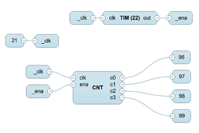
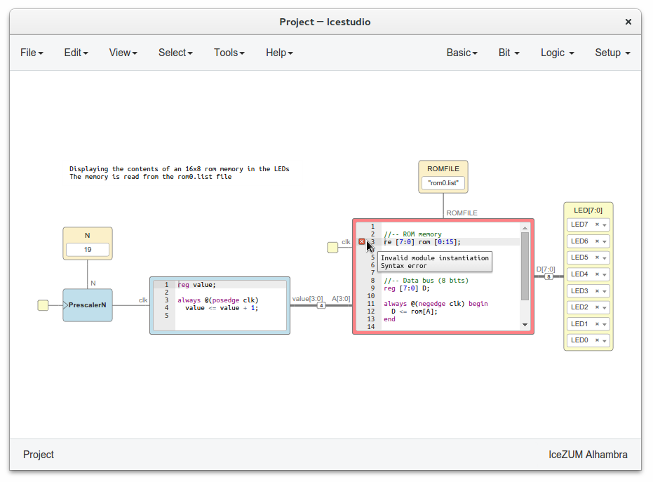

[](https://travis-ci.org/FPGAwars/icestudio)
[](https://github.com/FPGAwars/icestudio/releases)
[](http://opensource.org/licenses/GPL-2.0)
[](http://icestudio.readthedocs.io/en/latest)

**Experimental** graphic editor for open FPGAs. Built on top of the [Icestorm project](http://www.clifford.at/icestorm/) using [Apio](https://github.com/FPGAwars/apio).

    Graphic design -> Verilog, PCF -> Bistream -> FPGA

### Supported boards

| Board name | GNU/Linux | Windows | Mac OS |
|:-|:-:|:-:|:-:|
| [Alhambra II](https://github.com/FPGAwars/Alhambra-II-FPGA) | :white_check_mark: | :white_check_mark: | :white_check_mark: |
| [IceZUM Alhambra](https://github.com/FPGAwars/icezum) | :white_check_mark: | :white_check_mark: | :white_check_mark: |
| [Kéfir I iCE40-HX4K](http://fpgalibre.sourceforge.net/Kefir/) | :white_check_mark: | :white_check_mark: | :white_check_mark: |
| [Nandland Go board](https://www.nandland.com/goboard/introduction.html) | :white_check_mark: | :white_check_mark: | :white_check_mark: |
| [iCE40-HX8K Breakout Board](http://www.latticesemi.com/en/Products/DevelopmentBoardsAndKits/iCE40HX8KBreakoutBoard) | :white_check_mark: | :white_check_mark: | :white_check_mark: |
| [iCEstick Evaluation Kit](http://www.latticesemi.com/icestick) | :white_check_mark: | :white_check_mark: | :white_check_mark: |
| [icoBOARD 1.0](http://icoboard.org/about-icoboard.html) |  &nbsp;&nbsp;:white_check_mark:&nbsp;**\*** | &nbsp;&nbsp;:white_check_mark:&nbsp;**\*** |  &nbsp;&nbsp;:white_check_mark:&nbsp;**\*** |
| [BlackIce](https://hackaday.io/project/12930-blackice-low-cost-open-hardware-fpga-dev-board) | :white_check_mark: | :white_check_mark: | :white_check_mark: |
| [BlackIce II](https://github.com/mystorm-org/BlackIce-II) | :white_check_mark: | :white_check_mark: | :white_check_mark: |
| [TinyFPGA B2](http://tinyfpga.com/b-series-guide.html) | :white_check_mark: | :white_check_mark: | :white_check_mark: |
| [TinyFPGA BX](http://tinyfpga.com/b-series-guide.html) | :white_check_mark: | :white_check_mark: | :white_check_mark: |

**\*** Use with Raspberry Pi

## Installation

* **GNU/Linux**

  1. Install [Python 2.7](https://www.python.org) and **xclip**
  2. Download and execute the [AppImage](https://github.com/FPGAwars/icestudio/releases)


* **Windows**

  1. Download and execute the [Windows installer](https://github.com/FPGAwars/icestudio/releases)


* **Mac OS**

  1. Install [Python 2.7](https://www.python.org) and [Homebrew](https://brew.sh)
  2. Download and execute the [DMG package](https://github.com/FPGAwars/icestudio/releases)





Check the [Documentation](http://icestudio.readthedocs.io/en/latest) for more information.

## Development

Install [Python 2.7](https://www.python.org/downloads/release/python-2711/) and [nodejs](https://github.com/nodejs/node).

[Atom](https://atom.io/) editor with [linter-jshint](https://atom.io/packages/linter-jshint) is recommended.

If you want to add blocks or examples, please contribute to [icestudio-blocks](https://github.com/FPGAwars/icestudio-blocks), [icestudio-examples](https://github.com/FPGAwars/icestudio-examples) or [collection-default](https://github.com/FPGAwars/collection-default).


##### Ubuntu

```bash
curl -sL https://deb.nodesource.com/setup_6.x | sudo -E bash -
sudo apt-get install -y nodejs
```

### Download

```bash
git clone https://github.com/FPGAwars/icestudio.git
cd icestudio
```

### Install

```bash
npm install
```

### Execute

```bash
npm start
```

### Languages

|  Language  | Translated strings                        |
|:----------:|:-----------------------------------------:|
| English    |  |
| Spanish    |  |
| French     |  |
| Chinese    |  |
| Catalan    |  |
| Basque     |  |
| Galician   |   |

**Contribute!**

Add or update the [app translations](https://github.com/FPGAwars/icestudio/tree/develop/app/resources/locale) using **[Poedit](https://poedit.net/)**.

*Developer note*: use `npm run gettext` to extract the labels from the code.

### Package

```bash
npm run dist
```

| Target OS | Development OS | Output files |
|:---:|:-------------:|:-----------------:|
| GNU/Linux | GNU/Linux | (linux32,linux64).zip, (linux32,linux64).AppImage |
| Windows | GNU/Linux | (win32,win64).zip, (win32,win64).exe |
|  Mac OS | Mac OS | (osx32,osx64).zip, osx64.dmg  |

### Troubleshooting

If you get this error `npm ERR! peerinvalid The package grunt@1.0.1 does not satisfy its siblings' peerDependencies requirements!`, try to update your **[nodejs](https://github.com/nodejs/node)** or execute:

```bash
npm update -g
```

[More information](https://github.com/angular-fullstack/generator-angular-fullstack/issues/431)

## Roadmap

There is a [Wishlist](https://github.com/FPGAwars/icestudio/wiki/Wishlist:-proposed-features) in the wiki with the features proposed by the Community. If you want to contribute with new features and ideas write in the [Google Group](https://groups.google.com/forum/#!forum/fpga-wars-explorando-el-lado-libre).

 We use the GitHub issues to schedule our new features and improvements.

## Videos

### Version 0.2

[](https://www.youtube.com/watch?v=DAStv80OtXQ "Icestudio: icoBOARD in a remote RPi2")

[](https://www.youtube.com/watch?v=OWnVCjo7N9Y "Icestudio: new gui & multiboard")

[](http://www.youtube.com/watch?v=mAIKb47z2Do "Icestudio: block factory")

## Authors

* [Jesús Arroyo Torrens](https://github.com/Jesus89)

## Contributors

* v0.3
  * [Lorea-Aldabaldetreku](https://github.com/Lorea-Aldabaldetreku)
  * [Carlos Díaz](https://github.com/C47D)
  * [Martoni](https://github.com/Martoni)
  * [Xoan Sampaiño](https://github.com/xoan)
  * [Unai](https://github.com/1138-4EB)
  * [Francisco Sayas](https://github.com/fsayas)
  * [Pascal Cotret](https://github.com/pcotret)
  * [Juan Jose Luna Espinosa](https://github.com/yomboprime)
  * [Salvador E. Tropea](https://github.com/set-soft)
  * [redbeard](https://github.com/brianredbeard)
* v0.2
  * [Tomás Calvo](https://github.com/tocalvo)
  * [Juan González (Obijuan)](https://github.com/Obijuan)
  * [Carlos Díaz](https://github.com/C47D)
  * [Xoan Sampaiño](https://github.com/xoan)
  * [Salvador E. Tropea](https://github.com/set-soft)
  * [Democrito](https://github.com/Democrito)
  * [Martoni](https://github.com/Martoni)
  * [Pascal Cotret](https://github.com/pcotret)
* v0.1
  * [Miguel Sánchez de León Peque](https://github.com/Peque)

## Credits

* v0.3, v0.2: using [JointJS](https://github.com/clientIO/joint) and [AlertifyJS](https://github.com/MohammadYounes/AlertifyJS)
* v0.1: using [AngularJS-Flowchart](https://github.com/codecapers/AngularJS-FlowChart)

* [FPGAwars](http://fpgawars.github.io/) community has developed this project in a voluntary and altruistic way since 02/2017.

  

* [BQ](https://www.bq.com) sponsored this project from 02/2016 to 02/2017. Thanks

  

## License

Licensed under [GPL 2.0](http://opensource.org/licenses/GPL-2.0) and [Creative Commons Attribution-ShareAlike 4.0 International License](http://creativecommons.org/licenses/by-sa/4.0/).
