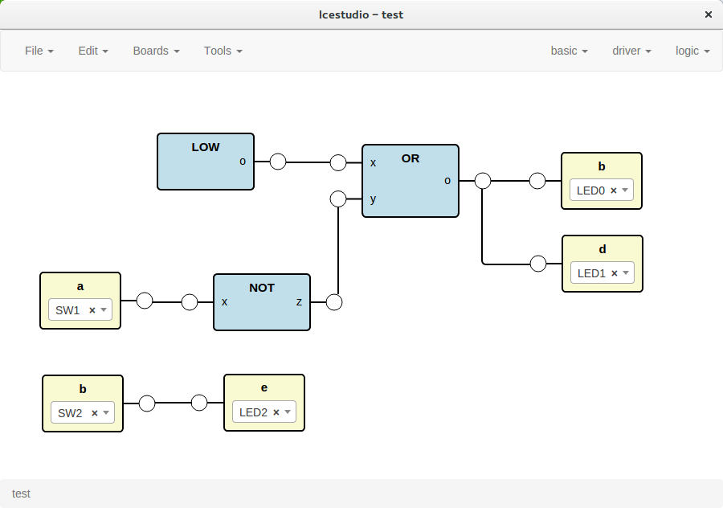
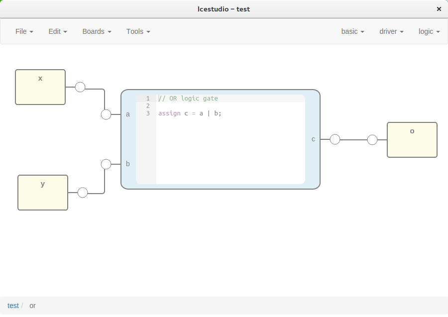

# Icestudio

[](https://github.com/Jesus89/icestudio)
[](http://opensource.org/licenses/GPL-2.0)

Experimental graphic editor for open FPGAs: [iCEstick](http://www.pighixxx.com/test/portfolio-items/icestick/) and [Icezum Alhambra](https://github.com/FPGAwars/icezum). Built on top of [icestorm project](http://www.clifford.at/icestorm/).

    GUI -> JSON -> Verilog, PCF

## Version 0.2 alpha





**Documentation: http://icestudio.readthedocs.io**

NOTE: this is an **early experimental version** and it is under development. Supported on Linux.

### Development

Install [Python 2.7](https://www.python.org/downloads/release/python-2711/)

Install [nodejs](https://github.com/nodejs/node)
```bash
curl -sL https://deb.nodesource.com/setup_4.x | sudo -E bash -
sudo apt-get install -y nodejs
```

### Download

```bash
git clone https://github.com/FPGAwars/icestudio.git
cd icestudio
```

### Install

```bash
npm install
```

### Execute

```bash
npm start
```

### Package

```bash
npm run dist
```

## Version 0.1

![][icestudio-0.1-demo]

### Installation

1. Install and configure the [drivers](https://github.com/FPGAwars/icestudio/wiki/Installing-the-drivers)

2. Download the [latest release](https://github.com/FPGAwars/icestudio/releases), unpack the zip and execute Icestudio

NOTE: initially supported on Linux (32, 64), Windows and Mac.

## Videos

### Version 0.1

[](http://www.youtube.com/watch?v=Okl4Rr_i6Qk "Icestudio: GUI for open FPGAs")

[](http://www.youtube.com/watch?v=pG1DsF9MIj0 "Icestudio: code generation")

## Authors

* Jesús Arroyo

## Contributors

* Miguel Sánchez de León Peque
* Tomás Calvo

## Credits

* v0.1: using [AngularJS-Flowchart](https://github.com/codecapers/AngularJS-FlowChart)
* v0.2: using [JointJS](https://github.com/clientIO/joint)
* Sponsored by BQ.

## License

Licensed under [GPLv2](http://opensource.org/licenses/GPL-2.0) and [Creative Commons Attribution-ShareAlike 4.0 International License](http://creativecommons.org/licenses/by-sa/4.0/)

[icestudio-0.1-demo]: doc/images/icestudio-demo.gif
