.. _blocks:

Blocks
======

Definition
----------

A block is an entity with *input* and *output* ports, parameters and some content.

  .. image:: ../resources/images/blocks/definition.png

Basic blocks
------------

Input block
```````````

* Type: ``basic.input``
* States:

  * FPGA pin: *yellow*
  * Virtual: *green*

* Show clock

Wire
~~~~

E.g.: basic FPGA input block with name *Button*.

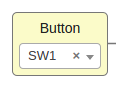

.. code-block:: json

  {
   "data": {
     "name": "Button",
     "pins": [
       {
         "index": "0",
         "name": "SW1",
         "value": "10"
       }
     ],
     "virtual": false,
     "clock": false
   }
  }


E.g.: basic Virtual input block with no name and the clock symbol.

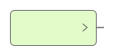

.. code-block:: json

  {
   "data": {
     "name": "",
     "pins": [
       {
         "index": "0",
         "name": "",
         "value": ""
       }
     ],
     "virtual": true,
     "clock": true
   }
  }

Bus
~~~

E.g.: basic FPGA input block with name *in[1:0]*.

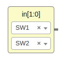

.. code-block:: json

  {
    "data": {
      "name": "in",
      "range": "[1:0]",
      "pins": [
        {
          "index": "1",
          "name": "SW1",
          "value": "10"
        },
        {
          "index": "0",
          "name": "SW2",
          "value": "11"
        }
      ],
      "virtual": false,
      "clock": false
    }
  }

E.g.: basic Virtual input block with name *in[1:0]*.

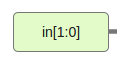

.. code-block:: json

  {
    "data": {
      "name": "in",
      "range": "[1:0]",
      "pins": [
        {
          "index": "1",
          "name": "",
          "value": ""
        },
        {
          "index": "0",
          "name": "",
          "value": ""
        }
      ],
      "virtual": true,
      "clock": false
    }
  }

Output block
````````````

* Type: ``basic.output``
* States:

  * FPGA pin: *yellow*
  * Virtual: *green*

Wire
~~~~

E.g.: basic FPGA output block with no name.

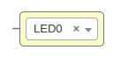

.. code-block:: json

   {
     "data": {
       "name": "",
       "pins": [
         {
           "index": "0",
           "name": "LED0",
           "value": "95"
         }
       ],
       "virtual": false
     }
   }

E.g.: basic Virtual output block with name "out".

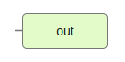

.. code-block:: json

  {
    "data": {
      "name": "out",
      "pins": [
        {
          "index": "0",
          "name": "",
          "value": ""
        }
      ],
      "virtual": true
    }
  }

Bus
~~~

E.g.: basic FPGA output block with name *out[1:0]*.

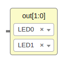

.. code-block:: json

  {
    "data": {
      "name": "out",
      "range": "[1:0]",
      "pins": [
        {
          "index": "1",
          "name": "LED0",
          "value": "95"
        },
        {
          "index": "0",
          "name": "LED1",
          "value": "96"
        }
      ],
      "virtual": false
    }
  }

E.g.: basic Virtual output block with name *[1:0]*.

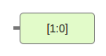

.. code-block:: json

  {
    "data": {
      "name": "",
      "range": "[1:0]",
      "pins": [
        {
          "index": "1",
          "name": "",
          "value": ""
        },
        {
          "index": "0",
          "name": "",
          "value": ""
        }
      ],
      "virtual": true
    }
  }

Constant block
``````````````

* Type: ``basic.constant``
* States:

  * Local parameter (lock)

E.g.: basic constant block with name *value* and the local flag.

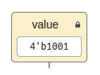

.. code-block:: json

   {
     "data": {
       "name": "value",
       "value": "4'b1001",
       "local": true
     }
   }

E.g.: basic constant block with no name and no local flag.

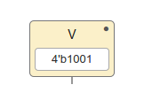

.. code-block:: json

  {
    "data": {
      "name": "",
      "value": "42",
      "local": false
    }
  }

Memory block
````````````

* Type: ``basic.memory``
* Address format:

  * Binary
  * Decimal
  * Hexadecimal

* States:

  * Local parameter (lock)

E.g.: basic memory block with name *code*, binary address format and the local flag.

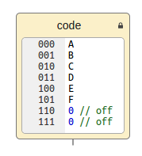

.. code-block:: json

   {
     "data": {
       "name": "code",
       "list": "A \nB\nC\nD\nE\nF\n0 // off\n0 // off",
       "local": true,
       "format": 2
     }
   }

E.g.: basic memory block with no name, decimal address format and no local flag.

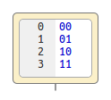

.. code-block:: json

  {
    "data": {
      "name": "",
      "list": "00\n01\n10\n11",
      "local": false,
      "format": 10
    }
  }

Code block
``````````

* Type: ``basic.code``

E.g.: basic code block with input port *a*, output port *b[3:0]* and parameters *C* and *D*.

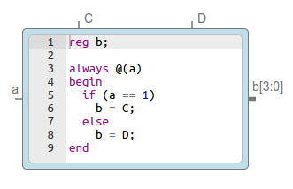

.. code-block:: json

   {
     "data": {
       "code": "reg [3:0] b_aux;\n\nalways @(a)\nbegin\n  if (a == 1)\n    b_aux = C;\n  else\n    b_aux = D;\nend\n\nassign b = b_aux;\n",
       "params": [
         {
           "name": "C"
         },
         {
           "name": "D"
         }
       ],
      "ports": {
        "in": [
          {
            "name": "a"
          }
        ],
        "out": [
          {
            "name": "b",
            "range": "[3:0]",
            "size": 4
          }
        ]
      }
    }
  }

Information block
`````````````````

* Type: ``basic.info``
* States:

  * Readonly

E.g.: basic information block in editor mode.

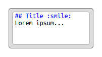

.. code-block:: json

   {
     "data": {
       "info": "## Title :smile:\nLorem ipsum...\n",
       "readonly": false
     }
   }

E.g.: basic information block in render mode.

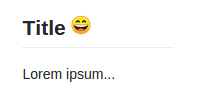

.. code-block:: json

  {
    "data": {
      "info": "## Title :smile:\nLorem ipsum...\n",
      "readonly": true
    }
  }

Generic blocks
--------------

Any project can be added as a read-only **generic block**:

* The *input blocks* become *input ports*.
* The *output blocks* become *output ports*.
* The *constant blocks* become *parameters*.

The block information is stored in **dependencies**, without the unnecessary information:

* The version number is removed.
* The FPGA *board* is removed.
* The FPGA *data.pins* are removed.
* An additional field *data.size* with the pins.length is created if greatter than 1.
* The *data.virtual* flag is removed.

E.g.: this project *block.ice*.

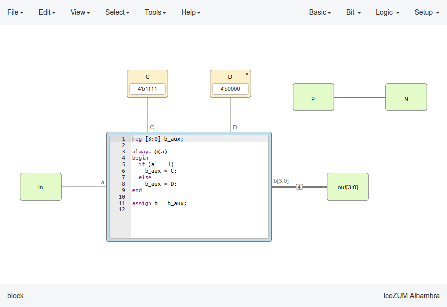

becomes this block:

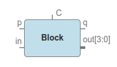

.. container:: toggle

    .. container:: header

        **Show/Hide code**

    |

    .. literalinclude:: ../resources/samples/block.ice
       :language: json

|
