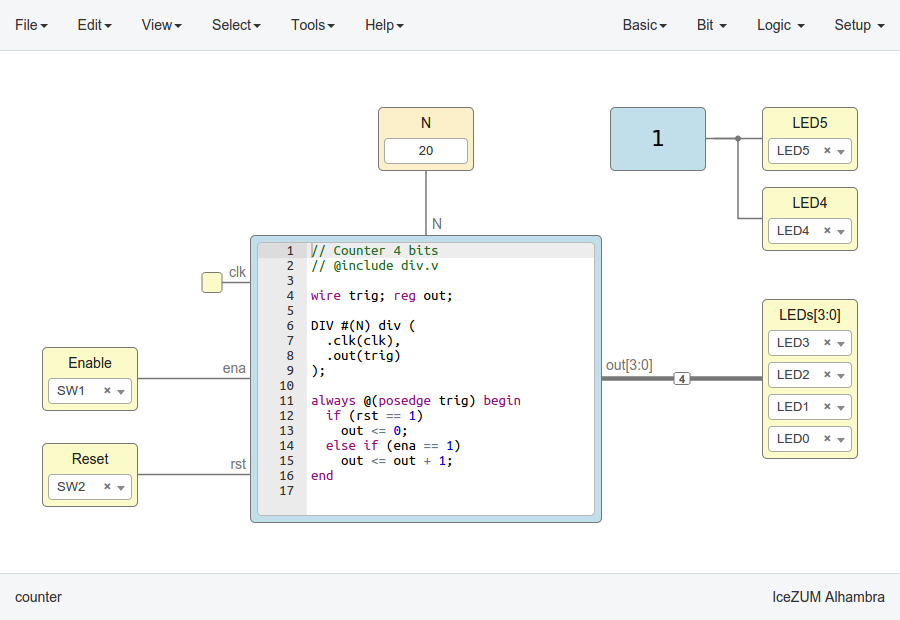

.. _compiler:

Compilers
=========

1. Verilog
2. PCF
3. Testbench
4. GTKWave

Implementation
--------------

Compiler `source code <https://github.com/FPGAwars/icestudio/blob/develop/app/scripts/services/compiler.js>`_.

Sample
------

Counter
```````



.. container:: toggle

    .. container:: header

        **counter.ice**

    |

    .. literalinclude:: ../resources/samples/compiler/counter.ice
       :language: json

|

.. container:: toggle

    .. container:: header

        **div.v**

    |

    .. literalinclude:: ../resources/samples/compiler/div.v

|

Generates
~~~~~~~~~

.. container:: toggle

    .. container:: header

        **counter.v**

    |

    .. literalinclude:: ../resources/samples/compiler/counter.v
       :language: verilog

|

.. container:: toggle

   .. container:: header

       **counter.pcf**

   |

   .. literalinclude:: ../resources/samples/compiler/counter.pcf

|

.. container:: toggle

   .. container:: header

       **counter_tb.v**

   |

   .. literalinclude:: ../resources/samples/compiler/counter_tb.v

|

.. container:: toggle

   .. container:: header

       **counter_tb.gtkw**

   |

   .. literalinclude:: ../resources/samples/compiler/counter_tb.gtkw

|
