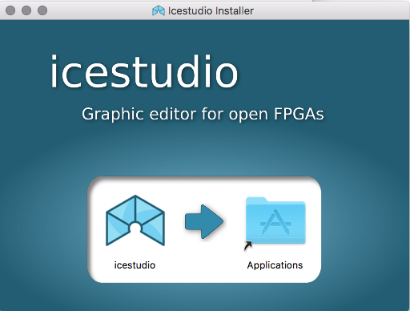
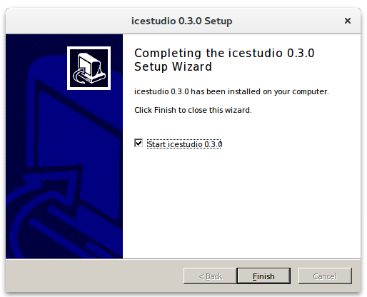

.. _installation:

Installation
============

GNU/Linux
---------

1. Install `Python 2.7 <https://www.python.org>`_ and **xclip** (to enable Copy/Paste).
2. Download the `AppImage <https://github.com/FPGAwars/icestudio/releases>`_ file and make it executable:

.. code::

  $ chmod a+x icestudio-0.3.3*.AppImage

.. hint::

  You can download the ZIP release and install it in the system using the script `linux_installer.sh <https://github.com/FPGAwars/icestudio/blob/develop/scripts/linux_installer.sh>`_. This script registers the *.ice* files as *Icestudio project*. There is also a `linux_uninstaller.sh <https://github.com/FPGAwars/icestudio/blob/develop/scripts/linux_uninstaller.sh>`_ to revert the previous configuration.

.. warning::

  Ubuntu/Debian users may need to add own "username" to the "dialout"
  group if they are not "root", doing this issuing a
  ``sudo usermod -a -G dialout $USER``.

  Ubuntu 18.04 users should install:
    - libgconf: `sudo apt install libgconf-2-4`
    - canberra-gtk-module: `sudo apt install libcanberra-gtk-module`

  Also if the fonts don't look good, this is because a bug in the Ubuntu distribution. Try `<this workaround https://steemit.com/linux/@arrowj/fixing-font-rendering-issues-in-ubuntu-bionic-beaver-lts>`_.

Mac OS
------

1. Install `Python 2.7 <https://www.python.org>`_.
2. Install `Homebrew <https://brew.sh>`_.
3. Download and execute the `DMG package <https://github.com/FPGAwars/icestudio/releases>`_.

|

Windows
-------

1. Download and execute the `Windows installer <https://github.com/FPGAwars/icestudio/releases>`_.

.. note::

  Python 2.7 will be installed automatically if it is not installed. This installer registers the *.ice* files as *Icestudio project*.

.. warning::

  If the error *Failed building wheel for apio [...]* appears `pip` installer may be blocked. Disable the antivirus and try again.
