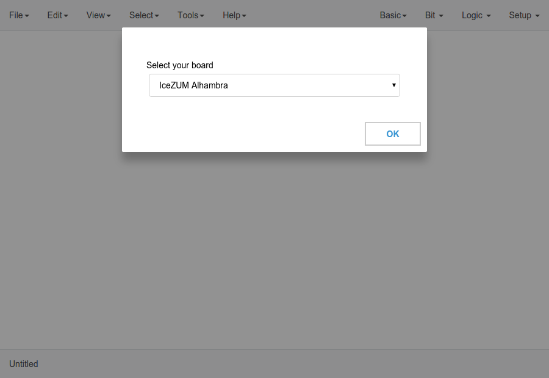
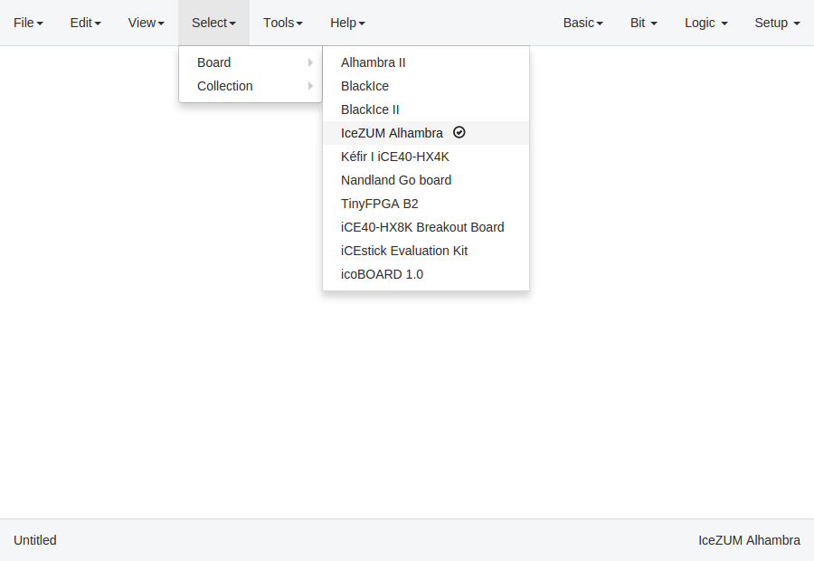
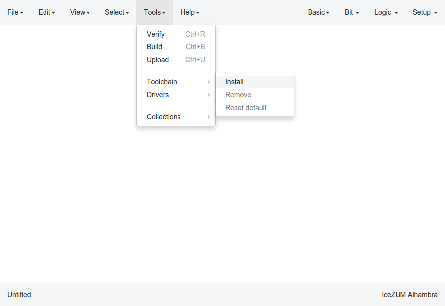
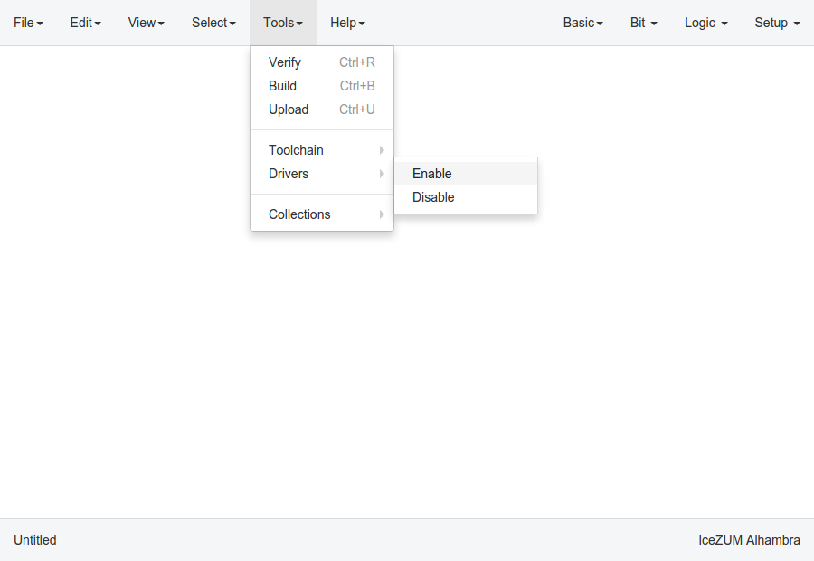
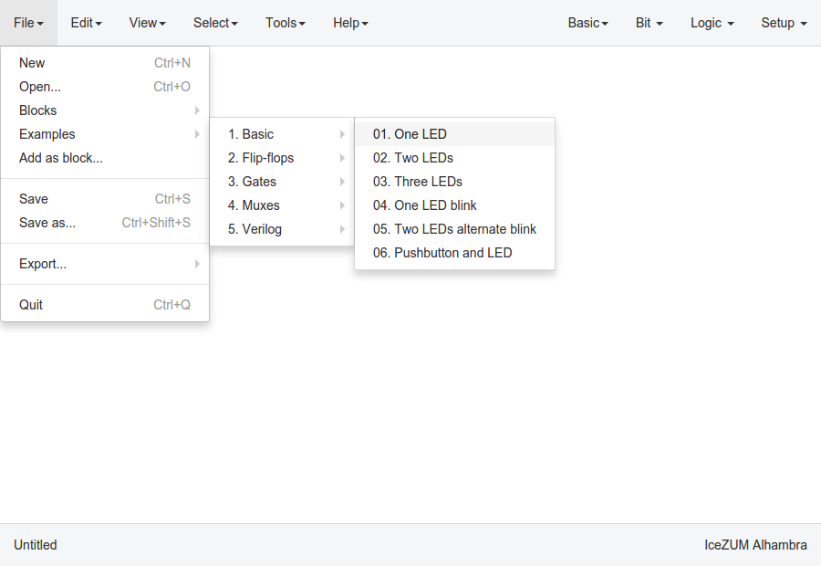
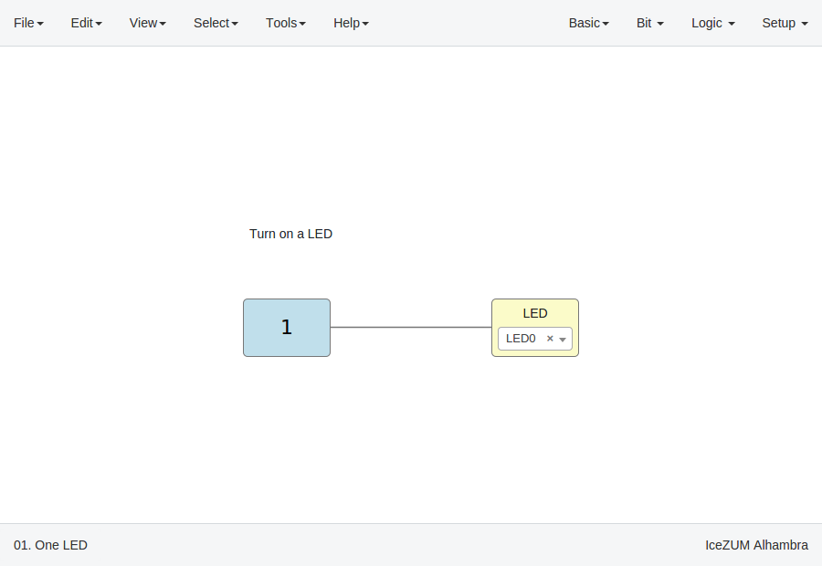
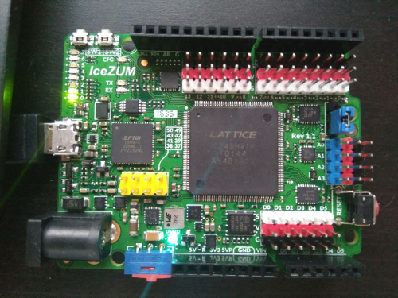

.. _quickstart:

Quick Start
===========

Select your board
-----------------

The first time you open the application, you have to select your FPGA board.

If you want to change the board, go to **Select > Board**

Setup the toolchain
-------------------

Go to **Tools > Toolchain > Install**

`Apio <https://github.com/FPGAwars/apio>`_ backend and all its needed `packages <https://github.com/FPGAwars/apio#apio-packages>`_ will be installed. This operation does not require Internet connection.

Setup the drivers
-----------------

Connect your FPGA board and select **Tools > Drivers > Enable**. This operation requires **administrator privileges**.

.. note::

    In Windows, an external application (Zadig) is launched to replace the existing FTDI driver of the **Interface 0** by **libusbK**.

    .. image:: ../resources/images/quickstart/zadig.png
        :align: center

    |

    In MacOS this operation requires Internet connection to allow `Homebrew` to install `libffi` and `libftdi` packages.

Upload a design
---------------

Go to **File > Examples > 1. Basic > 01. One LED**

Then, you can verify, build or upload the project in **Tools > Verify | Build | Upload**.

.. image:: ../resources/images/quickstart/upload.png

Here is the FPGA board with the **LED0** turned on.

