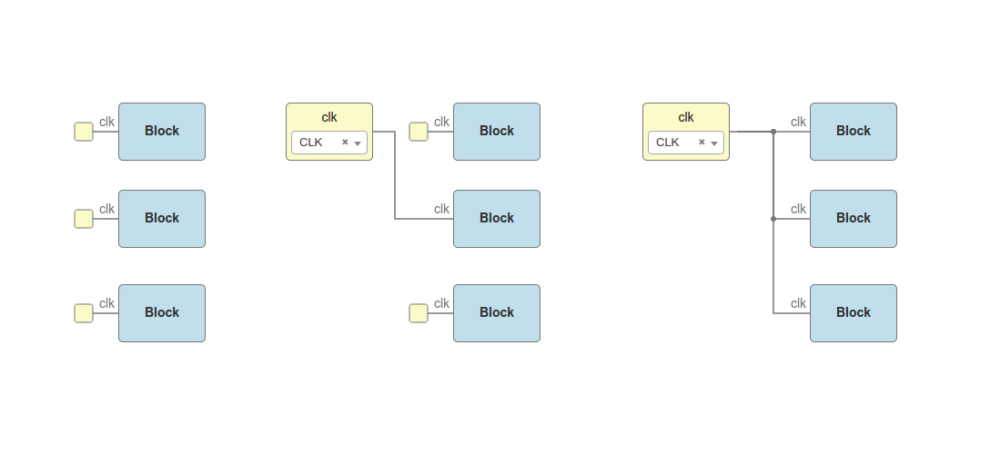

.. _rules:

Board Rules
===========

Icestudio *board rules* allow to automate tasks such as connecting all input *CLK* wires in a sequential circuit or initializing certain output ports to 1 or 0. The result is an easier and cleaner design. In Icestudio, rules can be enabled or disabled in "Edit > Preferences > Board rules".

The board rules are implemented in the *rules.json* file in each board directory. Each rule file is attached to a specific board. For example, this could be a rules file for the *IceZUM Alhambra*:

File: **rules.json**

.. code-block:: json

    {
      "input" : [
        {
          "port" : "clk",
          "pin": "21"
        }
      ],
      "output": [
        {
          "pin": "95",
          "bit": "0"
        },
        {
          "pin": "96",
          "bit": "0"
        },
        {
          "pin": "97",
          "bit": "0"
        },
        {
          "pin": "98",
          "bit": "0"
        }
      ]
    }

Input rules
-----------

Input rules define default connections between not connected ports with the name **port** and the specified FPGA I/O **pin**. In the example above, all not connected input ports named "clk" are automatically connected to the pin "21".

With the rules enabled, these three designs are equivalent:

.. note::

  If an input rule is set for ports named "clk", it also applies to input ports with "Show clock" enabled.

Output rules
------------

Output rules define default **bit** values for unused output FPGA I/O **pins**. In the example above, output pins "95", "96", "97" and "98" will be initialized to "0" if they do not appear in the circuit.

With the rules enabled, these two designs are equivalent:

.. image:: ../resources/images/rules/output-rules-crop.png
