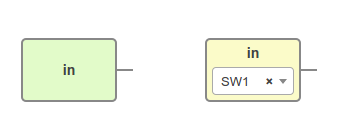
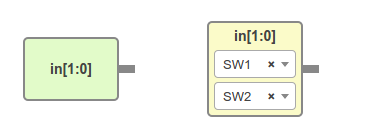
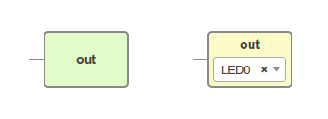
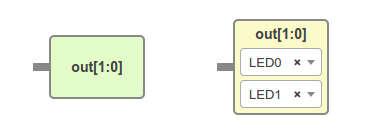
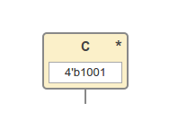
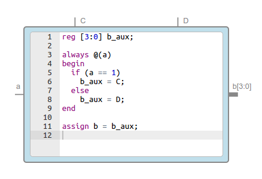
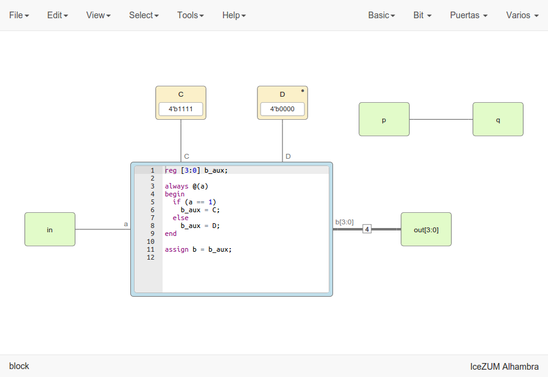
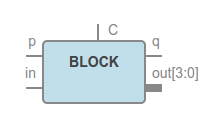

.. sec-blocks

Blocks
======

Definition
----------

A block is an entity with *input* and *output* ports, parameters and some content.

  .. image:: ../resources/images/blocks/definition.png

Basic blocks
------------

Input block
```````````

* Type: ``basic.input``
* States:

  * Virtual: *green*
  * FPGA I/O: *yellow*

Wire
~~~~

E.g.: basic input block with value *in*



|

.. code-block:: json

   {
     "data": {
       "name": "in",
       "pins": [
         {
           "index": "0",
           "name": "SW1",
           "value": "10"
         }
       ],
       "virtual": false
     }
   }

Bus
~~~

E.g.: basic input block with value *in[1:0]*



|

.. code-block:: json

    {
      "data": {
        "name": "in",
        "range": "[1:0]",
        "pins": [
          {
            "index": "1",
            "name": "SW1",
            "value": "10"
          },
          {
            "index": "0",
            "name": "SW2",
            "value": "11"
          }
        ],
        "virtual": false
      }
    }

Output block
````````````

* Type: ``basic.output``
* States:

  * Virtual: *green*
  * FPGA I/O: *yellow*

Wire
~~~~

E.g.: basic output block with value *out*



.. code-block:: json

   {
     "data": {
       "name": "out",
       "pins": [
         {
           "index": "0",
           "name": "LED0",
           "value": "95"
         }
       ],
       "virtual": false
     }
   }

Bus
~~~

E.g.: basic output block with value *out[1:0]*



.. code-block:: json

    {
      "data": {
        "name": "out",
        "range": "[1:0]",
        "pins": [
          {
            "index": "1",
            "name": "LED0",
            "value": "95"
          },
          {
            "index": "0",
            "name": "LED1",
            "value": "96"
          }
        ],
        "virtual": false
      }
    }

Constant block
``````````````

* Type: ``basic.constant``
* States:

  * Local parameter: *\**

E.g.: basic constant block with value *C*



.. code-block:: json

   {
     "data": {
       "name": "C",
       "value": "4'b1001",
       "local": true
     }
   }

Code block
``````````

* Type: ``basic.code``

E.g.: basic code block with input port *a*, output port *b[3:0]* and parameters *C* and *D*



.. code-block:: json

   {
     "data": {
       "code": "reg [3:0] b_aux;\n\nalways @(a)\nbegin\n  if (a == 1)\n    b_aux = C;\n  else\n    b_aux = D;\nend\n\nassign b = b_aux;\n",
       "params": [
         {
           "name": "C"
         },
         {
           "name": "D"
         }
       ],
      "ports": {
        "in": [
          {
            "name": "a"
          }
        ],
        "out": [
          {
            "name": "b",
            "range": "[3:0]",
            "size": 4
          }
        ]
      }
    }
  }

Info block
``````````

* Type: ``basic.info``

E.g.: basic info block

.. image:: ../resources/images/blocks/basic-info.png

.. code-block:: json

   {
     "data": {
       "info": "Lorem ipsum\n...\n"
     }
   }

Generic blocks
--------------

Any project can be added as a read-only **generic block**:

* The *input blocks* become *input ports*
* The *output blocks* become *output ports*
* The *constant blocks* become *parameters*

The block information is stored in **design.deps**, without the unnecessary information:

* The FPGA *board* is removed
* The FPGA *data.pins* are removed (an additional field *data.size* with the pins.length is created if >1)
* The *data.virtual* flag is removed

E.g.: this project *block.ice*



becomes this block



.. container:: toggle

    .. container:: header

        **Show/Hide code**

    |

    .. literalinclude:: ../resources/samples/block.ice
       :language: json

|
