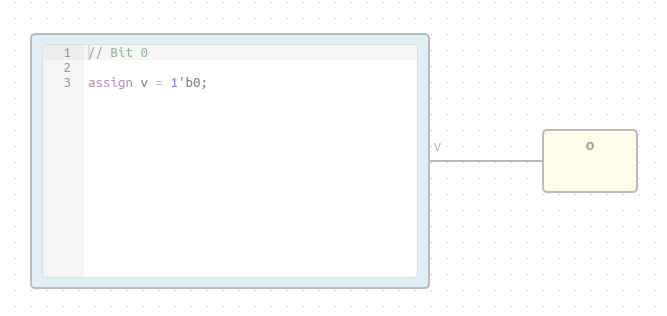
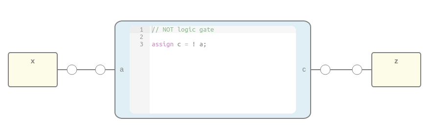
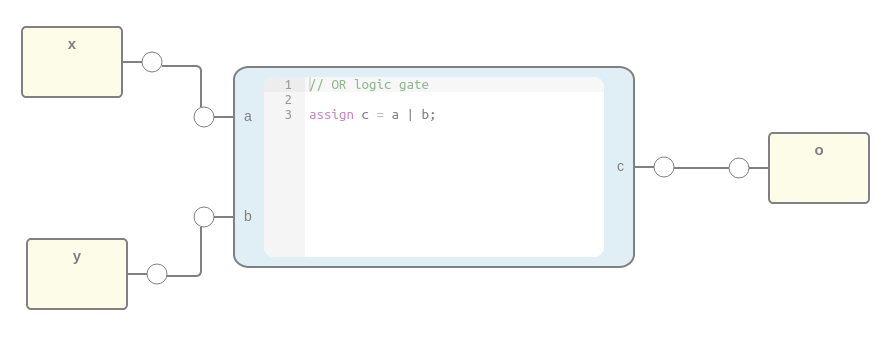
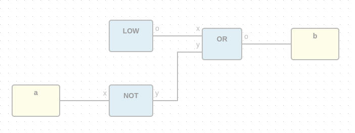
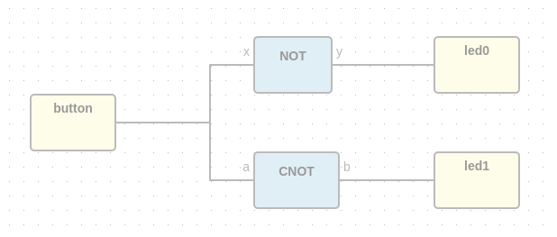

.. sec-blocks

Blocks
======

Definitions
-----------

Block
`````

A block is an entity with *input* and *output* ports composed by blocks.

Its *input* and *output* ports are defined from its *input* and *output* block instances.

Extension: **.iceb**

  .. image:: ../resources/svg/block-definition.svg

  |

.. code-block:: json

   {
     "graph": {
       "blocks" : [],
       "wires": []
     },
     "deps" : {},
     "image": "",
     "state": {
       "pan": {
         "x": 0,
         "y": 0
       },
       "zoom": 1
     }
   }

Block instances
'''''''''''''''

.. code-block:: json

   {
     "id": "",
     "type": "",
     "data": {},
     "position": {
       "x": 0,
       "y": 0
     }
   }


Wire instances
''''''''''''''

.. code-block:: json

   {
     "source": {
       "block": "",
       "port": ""
     },
     "target": {
       "block": "",
       "port": ""
     },
     "vertices": [
        {
          "x": 0,
          "y": 0
        }
     ]
   }


Basic blocks
------------

Input instance
``````````````

This special block is used to define input blocks in a project.
It has one output port named 'out'.


.. code-block:: json

   {
     "id": "",
     "type": "basic.input",
     "data": {
       "label": "a"
     },
     "position": {
       "x": 0,
       "y": 0
     }
   }

Output instance
```````````````

This special block is used to define output blocks in a projects.
It has one input port named 'in'.


.. code-block:: json

   {
     "id": "",
     "type": "basic.output",
     "data": {
       "label": "o"
     },
     "position": {
       "x": 0,
       "y": 0
     }
   }

Code instance
`````````````

This special block is used to define verilog code in a block.
It has input and output ports defined in *value.ports* field.

.. image:: ../resources/svg/basic-code.svg

.. code-block:: json

   {
     "id": "",
     "type": "basic.code",
     "data": {
       "code": "// And gate\n\nassign o = a & b;\n",
       "ports": {
         "in": [
           "a",
           "b"
          ],
          "out": [
            "o"
          ]
        }
     },
     "position": {
       "x": 0,
       "y": 0
     }
   }

Simple blocks
-------------

Simple blocks contain **only** basic blocks.
It has no dependencies.

Low block
`````````



File: **low.iceb**

.. container:: toggle

    .. container:: header

        **Show/Hide code**

    |

    .. literalinclude:: ../resources/examples/low/low.iceb
       :language: json

|

Not block
`````````



File: **not.iceb**

.. container:: toggle

    .. container:: header

        **Show/Hide code**

    |

    .. literalinclude:: ../resources/examples/not/not.iceb
       :language: json

|

Or block
````````



File: **or.iceb**

.. container:: toggle

    .. container:: header

        **Show/Hide code**

    |

    .. literalinclude:: ../resources/examples/or/or.iceb
       :language: json

|

Complex blocks
--------------

Complex blocks contain **not only** basic blocks.

Cnot block
``````````



File: **cnot.iceb**

.. container:: toggle

    .. container:: header

        **Show/Hide code**

    |

    .. literalinclude:: ../resources/examples/cnot/cnot.iceb
       :language: json

|

Dnot block
``````````



File: **dnot.iceb**

.. container:: toggle

    .. container:: header

        **Show/Hide code**

    |

    .. literalinclude:: ../resources/examples/dnot/dnot.iceb
       :language: json

|
