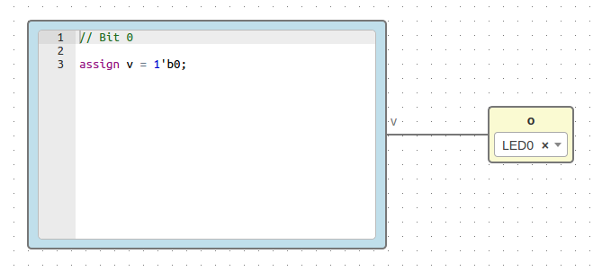
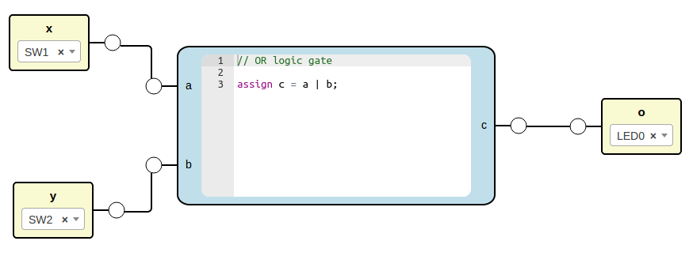
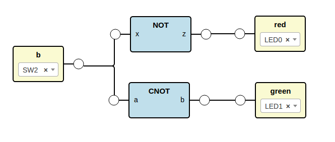

.. sec-compiler

Compiler
========

The JSON structure of a project is a block definition.

Output verilog structure:

1. Modules
2. Main module

   a. Wires definition
   b. Wires connections
   c. Blocks instances

Implementation
--------------

.. container:: toggle

    .. container:: header

        **Show/Hide code**

    |

    .. literalinclude:: ../code/compiler.js
       :language: javascript
       :linenos:

|

.. code-block:: bash

  npm install fs sha1

.. code-block:: bash

  node compiler.js

Examples
--------

Low project
```````````



.. container:: toggle

    .. container:: header

        **Show/Hide code**

    |

    .. literalinclude:: ../resources/examples/low.ice
       :language: json

    Generates

    .. literalinclude:: ../resources/examples/low/low.v
       :language: verilog

    .. literalinclude:: ../resources/examples/low/low.pcf
       :language: verilog

|

Not project
```````````

.. image:: ../resources/images/not-project.png

File: **not.iceb**

.. container:: toggle

    .. container:: header

        **Show/Hide code**

    |

    .. literalinclude:: ../resources/examples/not/not.ice
       :language: json

    Generates

    .. literalinclude:: ../resources/examples/not/not.v
        :language: verilog

    .. literalinclude:: ../resources/examples/not/not.pcf
        :language: verilog

|

Or project
``````````



File: **or.iceb**

.. container:: toggle

    .. container:: header

        **Show/Hide code**

    |

    .. literalinclude:: ../resources/examples/or/or.ice
       :language: json

    Generates

    .. literalinclude:: ../resources/examples/or/or.v
        :language: verilog

    .. literalinclude:: ../resources/examples/or/or.pcf
        :language: verilog

|

Cnot project
````````````

.. image:: ../resources/images/cnot-project.png

File: **cnot.iceb**

.. container:: toggle

    .. container:: header

        **Show/Hide code**

    |

    .. literalinclude:: ../resources/examples/cnot/cnot.ice
       :language: json

    Generates

    .. literalinclude:: ../resources/examples/cnot/cnot.v
        :language: verilog

    .. literalinclude:: ../resources/examples/cnot/cnot.pcf
        :language: verilog

|

Dnot project
````````````



File: **dnot.iceb**

.. container:: toggle

    .. container:: header

        **Show/Hide code**

    |

    .. literalinclude:: ../resources/examples/dnot/dnot.ice
       :language: json

    Generates

    .. literalinclude:: ../resources/examples/dnot/dnot.v
        :language: verilog

    .. literalinclude:: ../resources/examples/dnot/dnot.pcf
        :language: verilog

|
