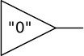
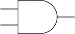

.. sec-compiler

Compiler
========

Output verilog structure:

1. Modules
2. Main module

   a. Wires
   b. Connections
   c. Nodes

Examples
--------

Example1
`````````

This block:



.. code-block:: json

   {
      "name": "driver0",
      "label": "\"0\"",
      "connectors": {
         "input": null,
         "output": [ { "id": "out", "label": "" } ]
      },
      "code": {
         "type": "verilog",
         "data" : "assign out = 1'b0;"
      }
   }

Will generate this module:

.. code-block:: verilog

   module driver0 (output out);
    assign out = 1'b0;
   endmodule

Example 2
`````````

This block:



.. code-block:: json

  {
     "name": "and",
     "label": "",
     "connectors": {
        "input": [ { "id": "a", "label": "" },
                   { "id": "b", "label": "" } ],
        "output": [ { "id": "out", "label": "" } ]
     },
     "code": {
        "type": "verilog",
        "data" : "assign out = a & b;"
     }
  }

Will generate this module:

.. code-block:: verilog

   module and (input a, b, output out);
    assign out = a & b;
   endmodule
