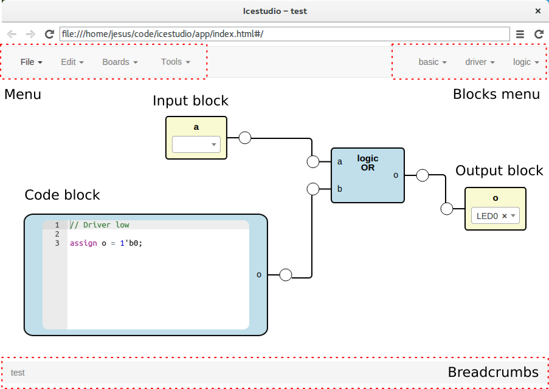
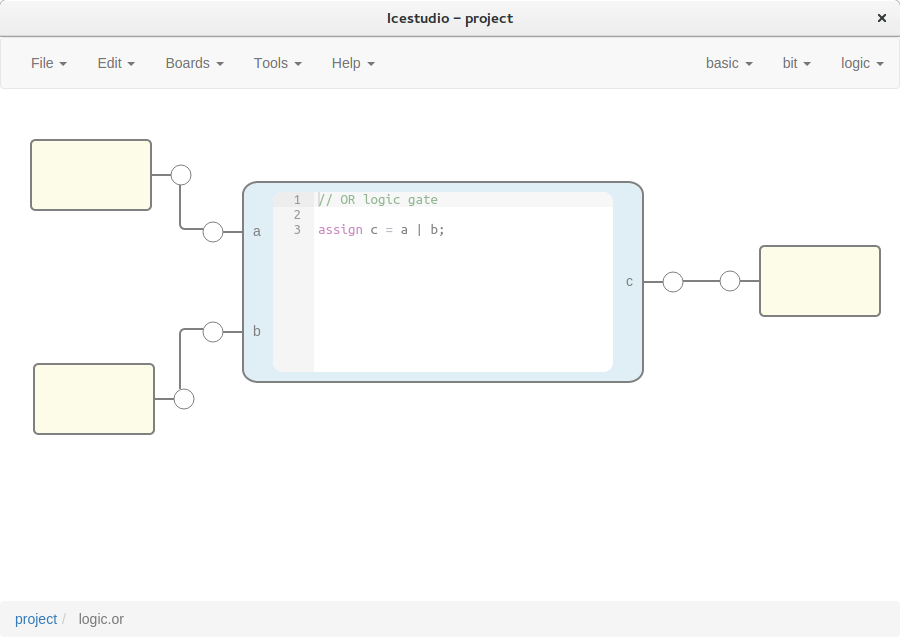

.. sec-gui

GUI
===



Source code: https://github.com/fpgawars/icestudio

Menu
----

File
````

* **New project**: create a new project.
* **Examples**: contains all stored examples. A example is loaded as a project.


* **Open project**: show a file dialog to open a project (.ice).
* **Save project**: show a save file dialog to save the current project (.ice).


* **Import block**: load a block file (.iceb) into the current project.
* **Export as block**: show a save file dialog to export the current project as a block file (.iceb).

.. note::

  When a project is exported as a block, all FPGA I/O information is removed.


.. hint::

  Examples are stored in `app/res/examples`. To create a new examples category just create a directory there. To create a new example copy and paste a **.ice** file.

Edit
````

* **Clear graph**: remove all blocks and wires from the graph.
* **Remove selected**: remove the selected block. It also can be done with *Supr* key.

Boards
``````
It contains the supported boards: **Icezum**, **iCEstick**, **Go board**. When a board is selected all I/O block combos are updated and its current values removed.

.. hint::

  This information is stored in the *app/scripts/services/boards.service.js* file. To support a new board just add its information to this file.

Tools
`````

* **Build**: generate the bitstream from the graphic source.
* **Upload**: generate and upload the bitstream to the FPGA board.

* **Install toolchain**: install a python virtualenv in `.icestudio/venv`, apio and icestorm toolchain.

.. hint::

  Generated files are stored in `_build` directory.

Blocks menu
-----------

Basic
`````

It contains the basic blocks:

* **code**: code block. Ports are asked in a prompt dialog.
* **input**: input block. Block name is asked in a prompt dialog.
* **output**: output block. Block name is asked in a prompt dialog.

Stored blocks
`````````````

It contains all stored blocks sorted by categories. These menu is generated when the application starts.

.. note::


  In code ports definition, *input* and *output* ports are separated by a space. Port names are separated by ``,``. For example: ``a,b``: input a and b, ``a,b c``: input a and b, output c.

.. note::

  Double click over *input* and *output* blocks allows to modify the block name. Multiple blocks can be created using the `space` separator. For example: ``x y z`` will create 3 blocks with those names. FPGA I/O ports values are set in the block combo box. These values can be set by searching and also unset by doing click on the cross.


.. hint::

  Examples are stored in `app/res/blocks`. To create a new block category just create a directory there. To create a new block copy and paste a **.iceb** file.


Graph
-----

This is the main panel. It contains the blocks and the wires.

Blocks inspection
`````````````````

Non-basic blocks can be readonly inspected by double click. This is a recursive action.



.. note::

  The inspection path is stored in the **breadcrumbs**. This allows to go back to any inspected block.
