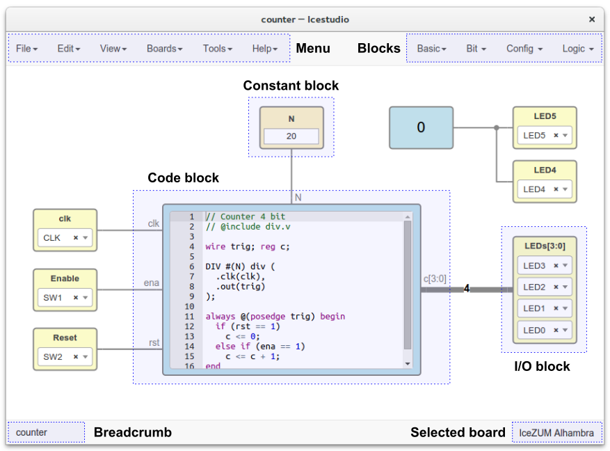
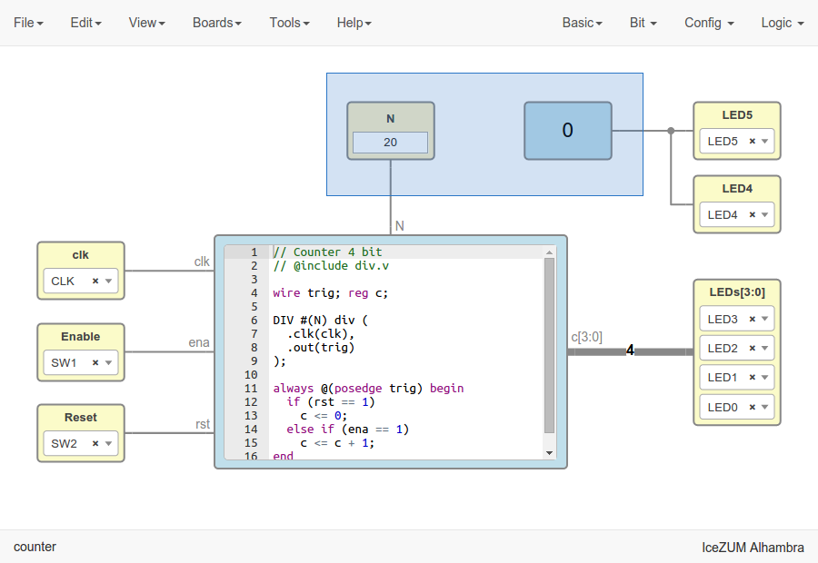
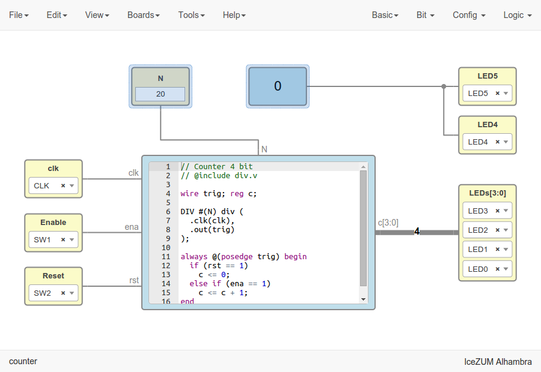
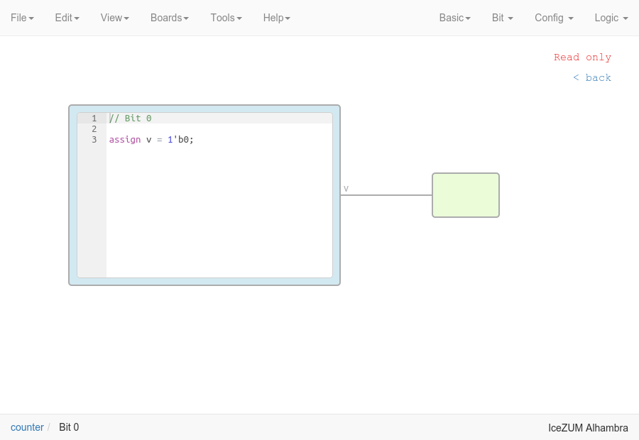

.. _gui:

GUI
===



Source code: https://github.com/fpgawars/icestudio


Menu
----

File
````

+-----------------+--------------+---------------------------------------------------------------+
|     Action      |   Shorcut    |                          Description                          |
+=================+==============+===============================================================+
|       New       |    Ctrl+N    |                     Create a new project                      |
+-----------------+--------------+---------------------------------------------------------------+
|     Open...     |    Ctrl+O    |                      Open a new project                       |
+-----------------+--------------+---------------------------------------------------------------+
| Add as block... |              |                   Add a project as a block                    |
+-----------------+--------------+---------------------------------------------------------------+
|    Examples     |              |               Show the selected board examples                |
+-----------------+--------------+---------------------------------------------------------------+
|      Save       |    Ctrl+S    |                   Save the current project                    |
+-----------------+--------------+---------------------------------------------------------------+
|   Save as...    | Ctrl+Shift+S |            Save the current project with a new name           |
+-----------------+--------------+---------------------------------------------------------------+
|    Export...    |              | Generate Verilog, PCF, Testbench and GTKwave from the project |
+-----------------+--------------+---------------------------------------------------------------+
|      Quit       |    Ctrl+Q    |                     Close the application                     |
+-----------------+--------------+---------------------------------------------------------------+

.. note::

  When a project is added as a block, all FPGA information is removed before being stored.

.. hint::

  Examples are stored in `app/resources/examples`. To create a new examples category just create a directory there. To create a new example copy and paste an **.ice** file.


Edit
````

+-------------+-----------------------+---------------------------------+
|   Action    |       Shortcut        |           Description           |
+=============+=======================+=================================+
|    Undo     |        Ctrl+Z         |     Revert the last change      |
+-------------+-----------------------+---------------------------------+
|    Redo     | Ctrl+Y | Ctrl+Shift+Z |      Revert the last undo       |
+-------------+-----------------------+---------------------------------+
|     Cut     |        Ctrl+X         |       Cut selected blocks       |
+-------------+-----------------------+---------------------------------+
|    Copy     |        Ctrl+C         |      Copy selected blocks       |
+-------------+-----------------------+---------------------------------+
|    Paste    |        Ctrl+P         |       Paste copied blocks       |
+-------------+-----------------------+---------------------------------+
| Select all  |        Ctrl+A         |      Select all the blocks      |
+-------------+-----------------------+---------------------------------+
| Reset view  |        Ctrl+0         |   Reset pan & zoom to default   |
+-------------+-----------------------+---------------------------------+
| Fit content |        Ctrl+F         | Fit the content into the screen |
+-------------+-----------------------+---------------------------------+

Preferences
'''''''''''

**Project information**

Contains all the information about the project:

  .. image:: ../resources/images/gui/project-info.png

  |

* Name: project name
* Version: version number
* Description: information shown in the block tooltip
* Author: creator of the project
* Image: SVG shown in the block body

**Remote hostname**

Set the hostame of a remote device with an FPGA board connected. The format is user@host. For example, pi@192.168.0.22. Verify, Build and Upload functions will be executed in this host, that must have apio pre-configured.

**Language**

Select the application language: English, Spanish, Galician, Basque and French. This selection is stored in the app profile.


View
````

+-------------+---------------------------------------------+
|   Action    |                 Description                 |
+=============+=============================================+
|     PCF     |           Show the board PCF file           |
+-------------+---------------------------------------------+
|    Pinout   |          Show the board SVG pinout          |
+-------------+---------------------------------------------+
|  Datasheet  | Open a web browser with the board datasheet |
+-------------+---------------------------------------------+
| Collections |         Select a collection of blocks       |
+-------------+---------------------------------------------+

.. note::

  A collection contains *categories and subcategories of blocks*. When a collection is selected the **Blocks Menu changes**:

  .. image:: ../resources/images/gui/collection-menu.png
     :align: center

  |

  The selected collection is stored in the app profile. Collections can be added/removed in the section **Tools > Collections**.


Boards
``````
It contains the supported boards: **IceZUM Alhambra**, **Go board**, **iCEstick**, **iCE40-HX8K**, **icoBOARD 1.0**, **Kéfir I**. When a board is selected all I/O block combos are updated and its current values reset.

.. hint::

  This information is stored in the `app/resources/boards` directory. In order to support a new board just create a new directory with the *info.json*, *pinout.pcf* and *pinout.svg* (optional) files with its information. The *pinout.json* file must be generated from the *pinout.pcf* using the *generator.py* script.


Tools
`````

+--------+----------+--------------------------------------------------------------+
| Action | Shortcut |                         Description                          |
+========+==========+==============================================================+
| Verify |  Ctrl+R  |               Check the generated verilog code               |
+--------+----------+--------------------------------------------------------------+
| Build  |  Ctrl+B  |            Generate the bitstream from the design            |
+--------+----------+--------------------------------------------------------------+
| Upload |  Ctrl+U  |  Generate (if required) and upload the bitstream to the FPGA |
+--------+----------+--------------------------------------------------------------+

Toolchain
'''''''''

+----------------+-----------------------------------------------------------------------------------+
|     Action     |                                    Description                                    |
+================+===================================================================================+
| Install/Update | Install a virtualenv, apio and the required apio packages. It requires Python 2.7 |
+----------------+-----------------------------------------------------------------------------------+
|     Remove     |                         Remove the toolchain directories                          |
+----------------+-----------------------------------------------------------------------------------+
| Reset default  |             Restore the default toolchain distributed within Icestudio            |
+----------------+-----------------------------------------------------------------------------------+
|  Apio version  |                           Show the current apio version                           |
+----------------+-----------------------------------------------------------------------------------+

Drivers
'''''''

+---------+------------------------------------------------------------------------+
| Action  |                              Description                               |
+=========+========================================================================+
| Enable  | Launch the FTDI drivers configuration. Each OS has a different process |
+---------+------------------------------------------------------------------------+
| Disable | Revert the FTDI drivers configuration. Each OS has a different process |
+---------+------------------------------------------------------------------------+

Collections
'''''''''''

+------------+---------------------------------------------+
|   Action   |                 Description                 |
+============+=============================================+
|    Add     | Add a ZIP file with one or more collections |
+------------+---------------------------------------------+
|   Remove   |       Remove the selected collection        |
+------------+---------------------------------------------+
| Remove all |         Remove all the collections          |
+------------+---------------------------------------------+

.. note::

  A collection must have the following structure:

  .. code::

    Category 1
    ├── block1.ice
    ├── Subcategory 1
    │   ├── block11.ice
    │   └── block12.ice
    └── Subcategory 2
        └── block21.ice

  A ZIP file of collections contains one or more *Category directories* at the main level. A collection can be selected in **View > Collections**.

.. hint::

    When a ZIP file is added to Icestudio, it is unzipped at `~/.icestudio/collections`.


Help
````

+-----------------+---------------------------------------------------+
|     Action      |                    Description                    |
+=================+===================================================+
|  View license   |    Open the Icestudio license in a web browser    |
+-----------------+---------------------------------------------------+
|     Version     |       Show the Icestudio current version          |
+-----------------+---------------------------------------------------+
|  Documentation  | Open the Icestudio documentation in a web browser |
+-----------------+---------------------------------------------------+
|   Source code   |  Open the Icestudio source code in a web browser  |
+-----------------+---------------------------------------------------+
| Community forum |     Open the FPGAwars forum in a web browser      |
+-----------------+---------------------------------------------------+
| About Icestudio |         Information about the application         |
+-----------------+---------------------------------------------------+


Blocks menu
-----------

Basic
`````

It contains the basic blocks:

* **Input**: show a dialog to insert the name and type of the input block.
* **Output**: show a dialog to insert the name and type of the output block.
* **Constant**: show a dialog to insert the name and type of the constant block.
* **Code**: show a dialog to insert the ports and parameters of the code block.
* **Information**: create an empty text box block.

.. note::

  **Input** and **output** ports can be set to **virtual**. Virtual ports allow to easily visualize independent-FPGA projects.
  Also, they can be configured as a **bus** by adding the notation ``[x:y]`` to the port name.

.. note::

  **Constant** blocks can be set to **local**. Local parameters are not exposed when the project is added as a block.

.. hint::

  Multiple **input**, **output** and **constant** blocks can be created using the `comma` separator. For example: ``x, y, z`` will create 3 blocks with those names. FPGA I/O ports values are set in the block combo box. These values can be set by searching and also unset by doing click on the cross.
  Double click over **input**, **output** or **constant** block allows to modify the block name and type.
  In **code** block ports definition, multiple *input* and *output* ports, and *parameters*, can be created also using the `comma` separator.


Stored blocks and collections
`````````````````````````````

It contains all stored blocks sorted by categories. These menu is generated when the application starts. It can show the Default blocks or any installed collection.

.. hint::

  Default blocks are stored in `app/resources/blocks`. All the installed collections are stored in `~/.icestudio/collections`.


Design
------

This is the main panel. It contains the blocks and the wires.


Pan & Zoom
``````````

Pan is performed using the **mouse left button** over the background. Zoom is performed using **mouse wheel**. Both values can be reset in *Edit > Reset view*.

.. image:: ../resources/images/gui/pan-zoom.png


Select
``````

Block selection is performed using the **mouse right button**. Blocks can be selected/unselected individually using `Right-click/Ctrl+Right-click`, respectively. In addition, several blocks can be selected by a selection box. A selection is canceled when the background is `Right-clicked`.




Move blocks
```````````

Any block or blocks selection can be moved in the design using the **mouse left button** over the block or the selection. Also a blocks selection can be moved with the **arrow keys**.




Block examination
`````````````````

Non-basic blocks can be read only examined by **double clicking** the block using the **mouse left button**. This is a recursive action. In order to go back, click on the **< back** link or press the **back key**.

During the examination, pan, zoom and code navigation are enabled.



.. note::

  The examination path is stored in the **breadcrumbs**. This allows to go back to any previous block.


Undo/Redo
``````````

Icestudio allows to undo/redo the following actions:

* Add or remove a block.
* Add or remove a wire.
* Move a block or a blocks selection.
* Edit an I/O block: name, type and value.
* Edit a Constant block: name, type and value.
* Edit a Code block: ports, parameters and content.
* Edit an Information block: content.
* Change the board.


Take a snapshot
---------------

Taking a **png** snapshot of the application is as easy as press `Ctrl+P`. A save dialog appears to set the name and the path of the captured image.
