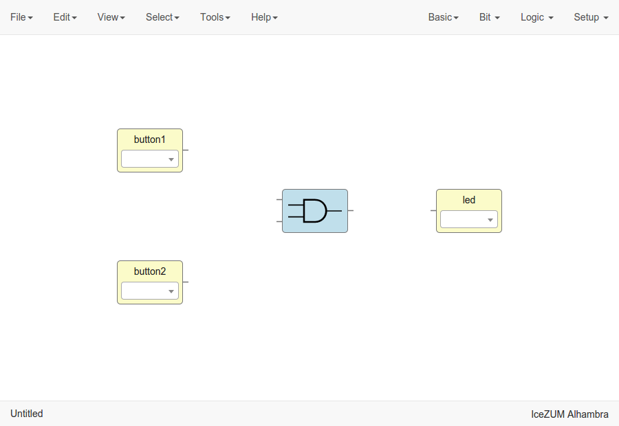
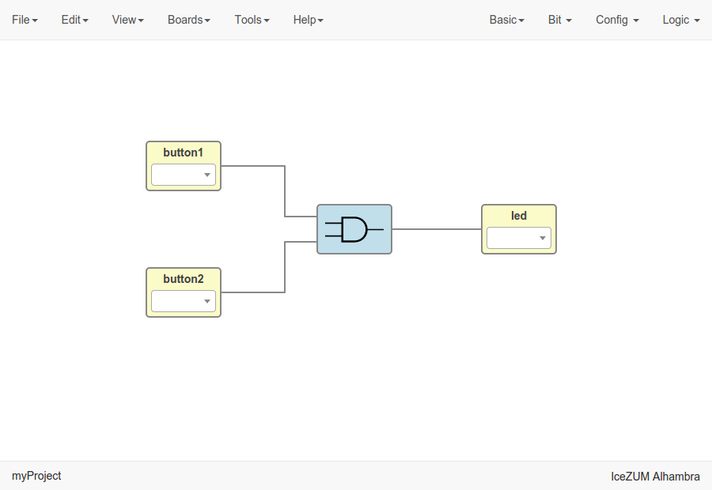
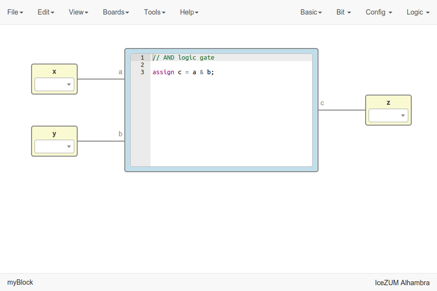
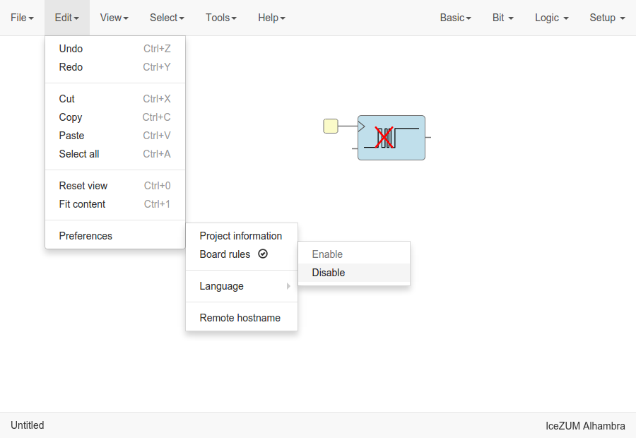
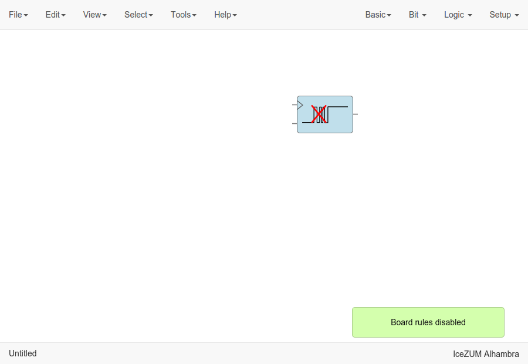

.. _howto:

How to...
=========

Install the toolchain
---------------------

1. **Install Python 2.7**

2. **Launch the toolchain installation process**

  Go to **Tools > Toolchain > Install**. Be patient for the toolchain installation.

  .. image:: ../resources/images/howto/installtoolchain.png

|

.. note::

  When the toolchain is installed, the menu option changes to **Tools > Toolchain > Update**. Also, the toolchain can be restored to default in **Tools > Toolchain > Reset default**.

Update the toolchain
---------------------

1. **Connect to the Internet**

2. **Launch the toolchain updating process**

  Go to **Tools > Toolchain > Update**. Be patient for the toolchain update.

Install the drivers
-------------------

1. **Install the toolchain** (required for Windows)

2. **Enable the FTDI drivers**

  Go to **Tools > Drivers > Enable**. Each OS has a different process. This configuration requires administration privileges.

.. note::

    In Windows, an external application (Zadig) is launched to replace the existing FTDI driver of the **Interface 0** by **libusbK**.

    .. image:: ../resources/images/quickstart/zadig.png
        :align: center

.. hint::

  To revert the drivers configuration go to **Tools > Drivers > Disable**

Create a collection package
---------------------------

1. **Create one or more collections**

  .. code::

    Collection/
    ├── blocks
    │   ├── category1
    │   │   ├── block1.ice
    │   │   └── subcategory1
    │   │       ├── block11.ice
    │   │       └── block12.ice
    │   └── category2
    │       └── block2.ice
    ├── examples
    │   ├── example1.ice
    │   ├── example2.ice
    │   └── example3.ice
    ├── locale
    │   ├── en
    │   │   └── en.po
    │   ├── es_ES
    │   │   └── es_ES.po
    │   └── translation.js
    └── package.json

2. **ZIP all your collections**

  Create a ZIP file with all your created collections at the main level.

  .. code::

    Collections.zip
    |
    ├── Collections 1
    │   └── ...
    └── Collections 2
        └── ...

.. note::

    The file **package.json** must exists, and also the **blocks** directory and/or the **examples** directory. The **locale** directory is optional. More information in the `Default collection <https://github.com/FPGAwars/icestudio/tree/develop/app/resources/collection>`_.

Add a collection
----------------

Go to **Tools > Collections > Add** and select a collection package (ZIP file).

Select a collection
-------------------

Go to **Select > Collections**. Select a collection. The first item is the "Default" collection that is the one stored in the application.

Create a project
----------------

1. **Create a new project**

   Go to **Edit > New**. A new window will be opened.

   .. image:: ../resources/images/howto/new.png

|

2. **Add blocks**

.. raw:: html

  <video src="add-blocks.webm" width="100%" height="auto" autoplay loop></video>

|

There are different types of blocks:

 1. *Input/Output blocks*

    Click on **Basic > Input** or **Basic > Output**, write the block's name and press OK or Enter.

    These blocks can be configured as **virtual** (green). Then, the FPGA pin selector won't be shown.

    Also, it can be configured as **buses** using the ``[x:y]`` notation (``x`` is the most significant bit).

    .. image:: ../resources/images/howto/io.png

 |

 2. *Constant blocks*

    Click on **Basic > Constant**, write the block's name and press OK or Enter.

    These blocks can be configures as **local**. Then, this parameter won't be exported.

    .. image:: ../resources/images/howto/constant.png

 |

 3. *Code blocks*

    Click on **Basic > Code**, add the code ports. Port names are separated by a comma. E.g.: ``a, b``.

    .. image:: ../resources/images/howto/code-prompt.png

    |

    This block contains a text editor to write your module in verilog code. Module header and footer are not required.

    .. image:: ../resources/images/howto/code.png

 |

 4. *Info blocks*

    Click on **Basic > Info**.

    This block contains a text editor to add comments about the project.

    .. image:: ../resources/images/howto/info.png

 |

 5. *Bit blocks*

    Click on **Bit > 0** or **Bit > 1**.

    These blocks are low and high logic drivers.

    .. image:: ../resources/images/howto/bit.png

 |

 6. *Config block*

    Click on **Config > Pull up / Pull up inv / Tri-state**.

    The *Pull up* block must be connected to input ports in order to configure a pull up in the FPGA.

    .. image:: ../resources/images/howto/config.png

 |

 7. *Logic blocks*

    Go to the **Logic** menu and select. This menu contains **Logic Gates**, **Combinational blocks** and **Sequential flip-flops**.

    .. image:: ../resources/images/howto/logic.png

|

3. **Connect the blocks**

|

|

4. **Select your board**

   Go to **Select > Board** and select **Go board**, **iCE40-HX8K**, **iCEstick**, **Icezum Alhambra**, **icoBOARD 1.0** or **Kéfir I**.

   .. image:: ../resources/images/howto/board.png

|

5. **Set FPGA I/O pins**

   Select all Input/Output blocks' pins.

   .. image:: ../resources/images/howto/fpgapin.png

|

6. **Save the project**

   Go to **Edit > Save as** and select the project name.

   It will be saved as an **.ice** file.

   .. image:: ../resources/images/howto/saveas.png

|

Upload a bitstream
------------------

1. **Open a project**

   Go to **Edit > Open...** and select an **.ice** file.

   |

2. **Verify the project**

   Go to **Tools > Verify**.

   This option checks the generated verilog code using ``apio verify``.

   .. image:: ../resources/images/howto/verify.png

   |

3. **Build the project**

   Go to **Tools > Build**.

   This option generates a bitstream using ``apio build``.

   .. image:: ../resources/images/howto/build.png

   |

4. **Upload the project**

   Connect your FPGA board and press **Tools > Upload**. This option uses ``apio upload``.

   .. image:: ../resources/images/howto/upload.png

   |

Create a block
--------------

1. **Open a project**

   Go to **Edit > Open project** and select an **.ice** file.

|

2. **Verify the project**

   Go to **Tools > Verify**.

|

2. **Add the project information**

   Go to **Edit > Preferences > Project information**.

   .. image:: ../resources/images/howto/project-info.png

   |

|

3. **Save the project**

   Go to **Edit > Save**.

   .. image:: ../resources/images/howto/save.png

   |

Add a project as block
----------------------

1. **Open or create a new project**

|

2. **Import the custom block**

   Go to **Edit > Add as block...** and select an **.ice** file.

   .. image:: ../resources/images/howto/addasblock.png

   |

   .. image:: ../resources/images/howto/customblock.png

   |

3. **Examine the custom block**

   Complex blocks can be examined by double clicking the block.

   .. image:: ../resources/images/howto/examine.png

   |

Include a list file
-------------------

If your code block contains a list file(s), for example:

.. code-block:: verilog

  $readmemh("rom.list", rom);

1. **Save the ice project**

2. **Copy the list file(s) in the project directory**

3. **Build and upload the project**

Include a verilog (header) file
-------------------------------

If your code block includes a verilog (header) file(s), for example:

.. code-block:: verilog

  // @include lib.vh
  // @include math.v

  `include "lib.vh"

1. **Save the ice project**

2. **Copy the verilog (header) file(s) in the project's directory**

3. **Build and upload the project**

Configure a remote host
------------------------

I you want to use a RPi, eg pi@192.168.0.22, or another computer from Icestudio as a client, first configure the host:

1. **Copy your SSH public key into the server**

  .. code-block:: bash

    $ ssh-keygen
    $ ssh-copy-id -i .ssh/id_rsa.pub pi@192.168.0.22

2. **Install apio in the server**

  .. code-block:: bash

    $ ssh pi@192.168.0.22
    $ sudo pip install -U apio
    $ apio install --all
    $ apio drivers --enable  # For FTDI devices

3. **Enter the host name in Icestudio, Edit > Remote hostname**

   .. image:: ../resources/images/howto/remotehost.png

   |

4. **Now, Verify, Build and Upload tools will run in the selected host**

View the board rules
--------------------

Go to **View > Board rules**

.. image:: ../resources/images/howto/icezum-rules.png

|

Disable the board rules
-----------------------

Go to **Edit > Preferences > Board rules > Disable**

|

|
