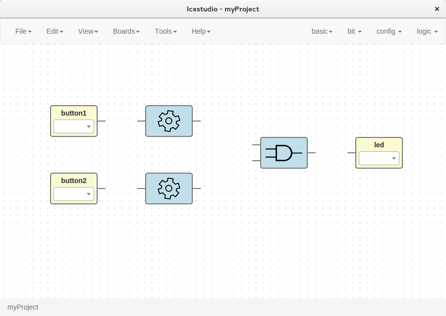
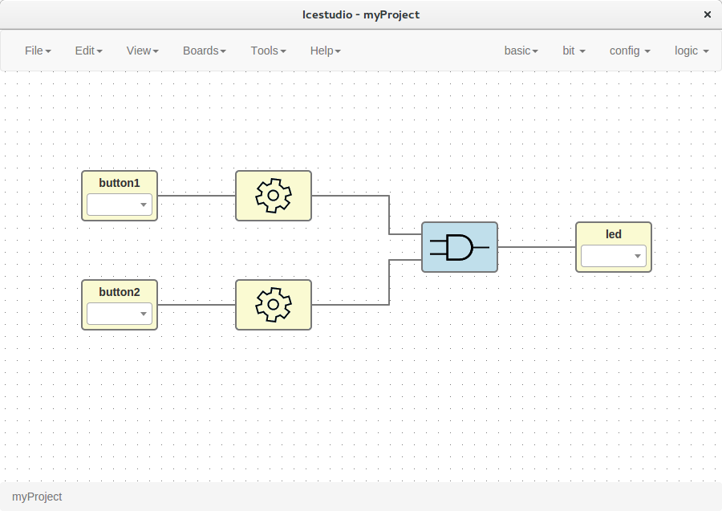
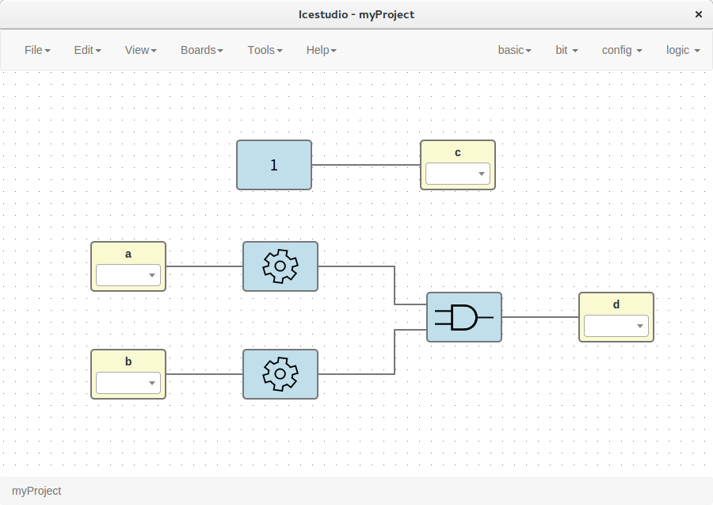

.. sec-howto

How to...
=========

Create a project
----------------

1. **Create a new project**

   Go to **Edit > New project**, write your project's name and press OK.

   .. image:: ../resources/images/howto-new.png

|

2. **Add your blocks**

 1. *Code blocks*

    Click on **basic > code**, add the code ports. Input and output ports are separated by a space. Port names are separated by a comma. E.g.: ``a,b c``.

    This block contains a text editor to write your module verilog code. Module header and footer are not required.

    .. image:: ../resources/images/howto-code.png

|

 2. *Info blocks*

    Click on **basic > info**.

    This block contains a text editor to add comments about the project.

    .. image:: ../resources/images/howto-info.png

|

 3. *Input/Output blocks*

    Click on **basic > input** or **basic > output**, write the block's name and press OK.

    These blocks contain a FPGA pin selector depending on the selected board.

    .. image:: ../resources/images/howto-io.png

|

 4. *Bit blocks*

    Click on **bit > 0** or **bit > 1**.

    These blocks are low and high logic drivers.

    .. image:: ../resources/images/howto-bit.png

|

 5. *Config block*

    Click on **config > Input-config**.

    This block must be connected to input ports in order to configure a pull up.

    .. image:: ../resources/images/howto-config.png

|

 6. *Logic blocks*

    Go to the **logic** menu and select a logic gate.

    .. image:: ../resources/images/howto-logic.png

|

3. **Connect your blocks**

|

|

4. **Select your board**

   Go to **Boards** menu and select **Icezum**, **iCEstick** or **Go board**.

   .. image:: ../resources/images/howto-board.png

|

5. **Set FPGA I/O pins**

   Select all Input/Output blocks' pins.

   .. image:: ../resources/images/howto-fpgapin.png

|

6. **Save the project**

   Go to **Edit > Save**:

   It will be saved as an **.ice** file.

   .. image:: ../resources/images/howto-save.png

|

Upload a bitstream
------------------

1. **Open a project**

   Go to **Edit > Open project** and select an **.ice** file.

   |

2. **Verify the project**

   Go to **Tools > Verify**.

   This option checks the generated verilog code using ``apio verify``.

   .. image:: ../resources/images/howto-verify.png

   |

3. **Build the project**

   Go to **Tools > Build**.

   This option generates a bitstream using ``apio build``.

   .. image:: ../resources/images/howto-build.png

   |

4. **Upload the project**

   Connect your FPGA board and press **Tools > Upload**. This option uses ``apio upload``.

   .. image:: ../resources/images/howto-upload.png

   |

.. note::

  If the FPGA toolchain is not installed, it will be installed automatically when any tool is pressed. It can also be installed or removed in the menu **Tools** section.

  .. image:: ../resources/images/howto-installtoolchain.png

  |

Create a block
--------------

1. **Open a project**

   Go to **Edit > Open project** and select an **.ice** file.

|

2. **Verify the project**

   Go to **Tools > Verify**.

|

3. **Export the project as a block**

   Go to **Edit > Export as block**.

   It will be saved as an **.iceb** file.

   .. image:: ../resources/images/howto-export.png

   |

.. note::

  Input/Output blocks will become new Block I/O pins.

Use a custom block
------------------

1. **Open or create a new project**

|

2. **Import the custom block**

   Go to **Edit > Import block** and select an **.iceb** file.

   .. image:: ../resources/images/howto-import.png

   |

   .. image:: ../resources/images/howto-customblock.png

   |

3. **Examine the custom block**

   Complex blocks can be examined by double clicking the block.

   .. image:: ../resources/images/howto-examine.png

   |

Include a list file
-------------------

If your code block contains a list file(s), for example:

.. code-block:: verilog

  $readmemh("rom.list", rom);

1. **Save the ice project**

2. **Copy the list file(s) in the project directory**

3. **Build and upload the project**

Include a verilog file
----------------------

If your code block includes a verilog file(s), for example:

.. code-block:: verilog

  // @include lib.v
  // @include math.v

1. **Save the ice project**

2. **Copy the verilog file(s) in the project's directory**

3. **Build and upload the project**

Configure a remote host
------------------------

I you want to use a RPi, eg pi@192.168.0.22, or another computer from Icestudio as a client, first configure the host:

1. **Copy your SSH public key into the server**

  .. code-block:: bash

    $ ssh-keygen
    $ ssh-copy-id -i .ssh/id_rsa.pub pi@192.168.0.22

2. **Install apio in the server**

  .. code-block:: bash

    $ ssh pi@192.168.0.22
    $ sudo pip install -U apio
    $ apio install --all
    $ apio drivers --enable  # For FTDI devices

3. **Enter the host name in Icestudio, Edit > Remote hostname**

   .. image:: ../resources/images/howto-remotehost.png

   |

4. **Now, Verify, Build and Upload tools will run in the selected host**
