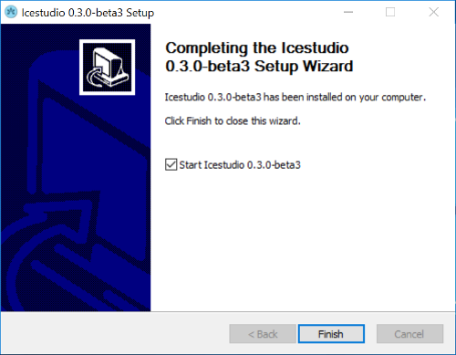
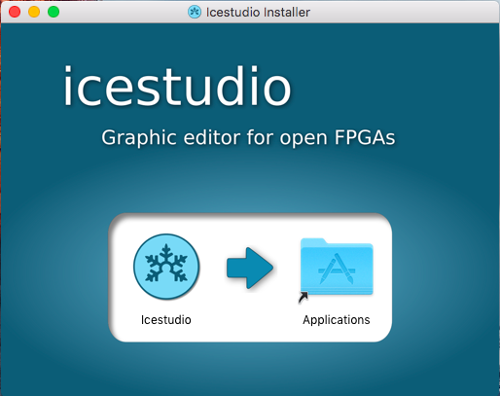

.. _installation:

Installation
============

GNU/Linux
---------

1. Install `Python 2.7 <https://www.python.org>`_ and **xclip** (to enable Copy/Paste).
2. Download the `AppImage <https://github.com/FPGAwars/icestudio/releases/tag/0.3.0-rc1>`_ file and make it executable:

.. code::

  $ chmod a+x icestudio-0.3.0*.AppImage

.. hint::

  You can download the ZIP release and install it in the system using the script `linux_installer.sh <https://github.com/FPGAwars/icestudio/blob/develop/scripts/linux_installer.sh>`_. This script registers the *.ice* files as *Icestudio project*. There is also a `linux_uninstaller.sh <https://github.com/FPGAwars/icestudio/blob/develop/scripts/linux_uninstaller.sh>`_ to revert the previous configuration.

Windows
-------

1. Download and execute the `Windows installer <https://github.com/FPGAwars/icestudio/releases/tag/0.3.0-beta3>`_.

.. note::

  Python 2.7 will be installed automatically if it is not installed. This installer registers the *.ice* files as *Icestudio project*.

Mac OS X
--------

1. Install `Python 2.7 <https://www.python.org>`_.
2. Download and execute the `DMG package <https://github.com/FPGAwars/icestudio/releases/tag/0.3.0-beta3>`_.

