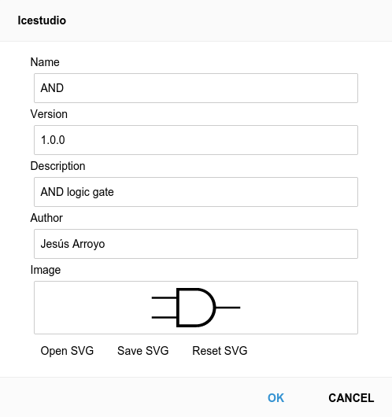

.. sec-project

Project
=======

Definition
----------

* Version: 1.0
* Package: project information
* Design: board information and circuit design

Extension: **.ice**

.. code-block:: json

    {
      "version": "1.0",
      "package": {
        "name": "",
        "version": "",
        "description": "",
        "author": "",
        "image": ""
      },
      "design": {
        "board": "",
        "graph": {
          "blocks": [],
          "wires": []
        },
        "dependencies": {},
        "state": {
          "pan": {
            "x": 0,
            "y": 0
          },
          "zoom": 1
        }
      }
    }

Block instances
'''''''''''''''

.. code-block:: json

    {
      "id": "",
      "type": "",
      "data": {},
      "position": {
        "x": 0,
        "y": 0
      }
    }


Wire instances
''''''''''''''

Wire
~~~~

.. code-block:: json

    {
      "source": {
        "block": "",
        "port": ""
      },
      "target": {
        "block": "",
        "port": ""
      },
      "vertices": [
        {
          "x": 0,
          "y": 0
        }
      ]
    }

Bus
~~~

.. code-block:: json

    {
      "source": {
        "block": "",
        "port": ""
      },
      "target": {
        "block": "",
        "port": ""
      },
      "vertices": [
        {
          "x": 0,
          "y": 0
        }
      ],
      "size": 2
    }

Project information
-------------------

* Name
* Version
* Description
* Author
* Image (SVG)



Samples
-------

1. in-out
```````````

.. image:: ../resources/images/project/1-in-out.png

|

File: **in-out.ice**

.. container:: toggle

    .. container:: header

        **Show/Hide code**

    |

    .. literalinclude:: ../resources/samples/1-in-out.ice
       :language: json

|
