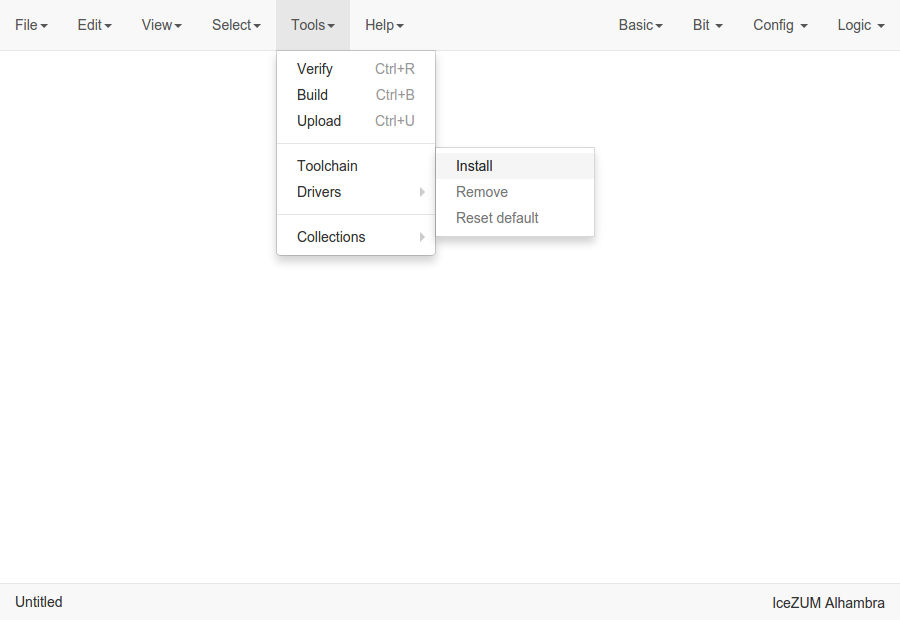
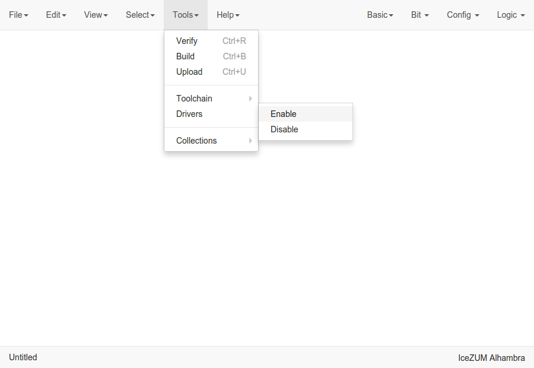
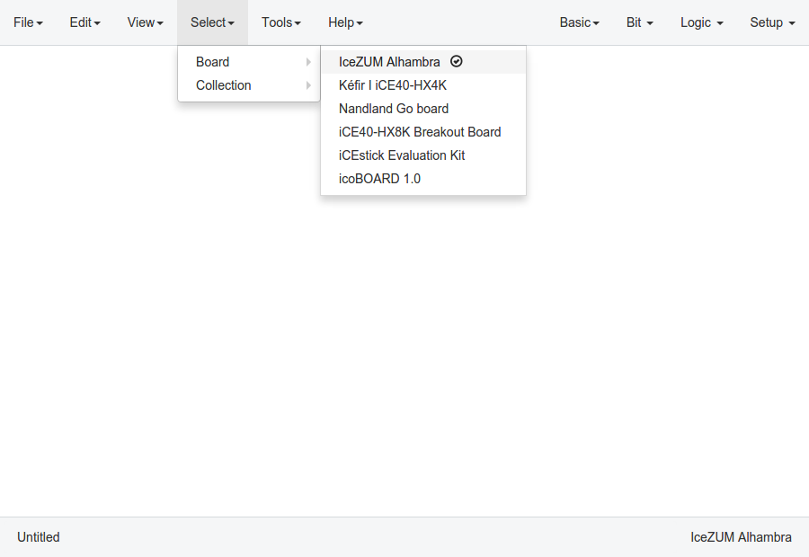
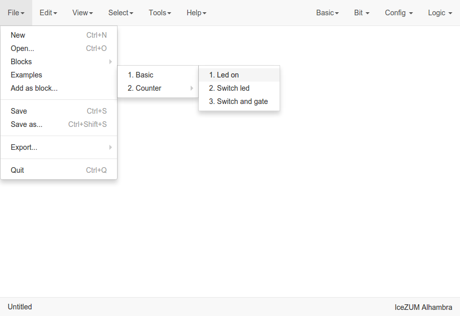
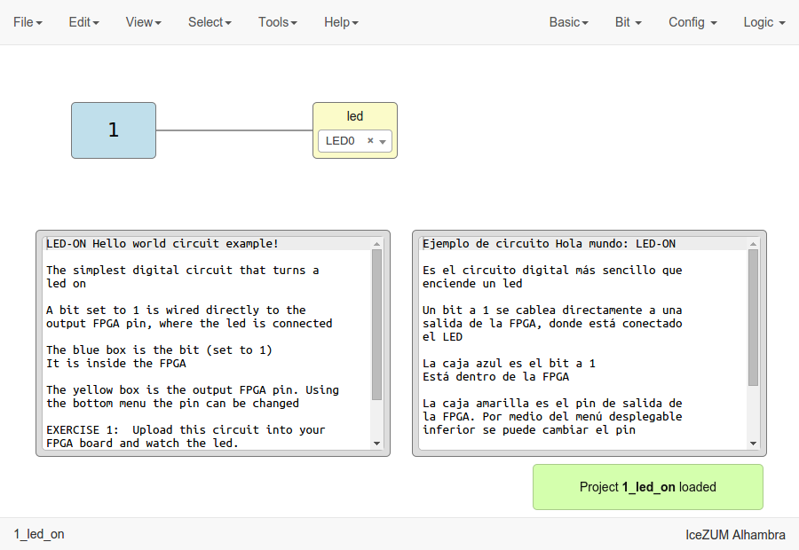
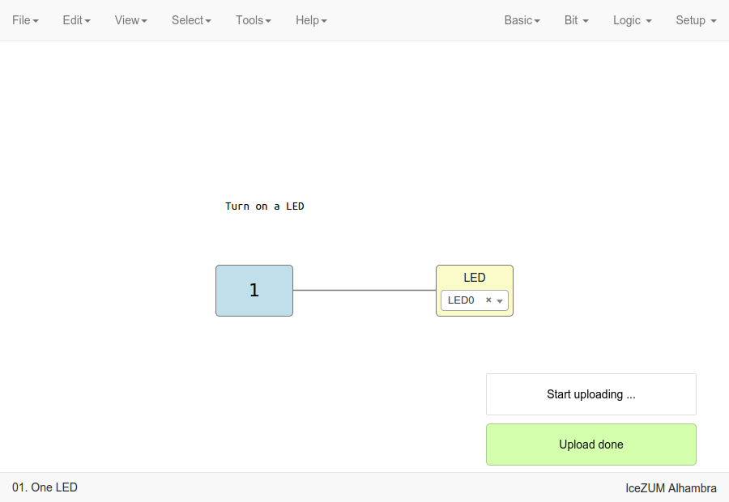

.. _quickstart:

Quick Start
===========

Setup the toolchain
-------------------

Go to **Tools > Toolchain > Install**

`Apio <https://github.com/FPGAwars/apio>`_ backend will be installed, and all its needed `packages <https://github.com/FPGAwars/apio#apio-packages>`_.

Setup the drivers
-----------------

Connect your FPGA board and select **Tools > Drivers > Enable**. This operation requires **administrator privileges**.

.. note::

    In Windows, an external application (Zadig) is launched to replace the existing FTDI driver of the **Interface 0** by **libusbK**.

    .. image:: ../resources/images/quickstart/zadig.png
        :align: center

Select your FPGA board
----------------------

Go to **Select > Board**

Upload an example
-----------------

Go to **File > Examples > 1. Basic > 1. Led on**

Then, you can verify, build or upload the project in **Tools > Verify | Build | Upload**.

Here is the FPGA board with the **LED0** turned on.

.. image:: ../resources/images/quickstart/icezum.png
