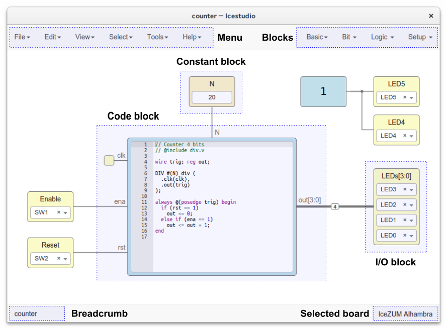
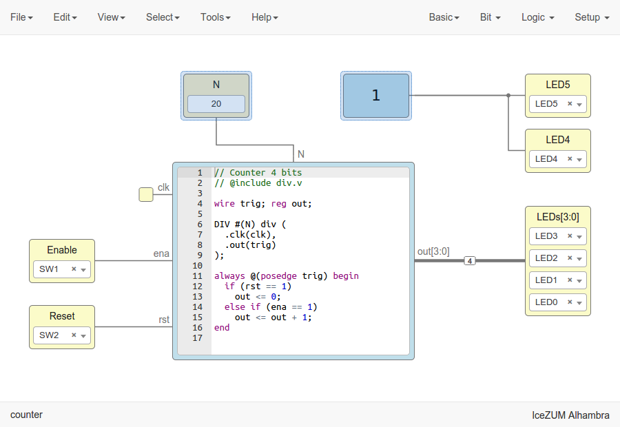
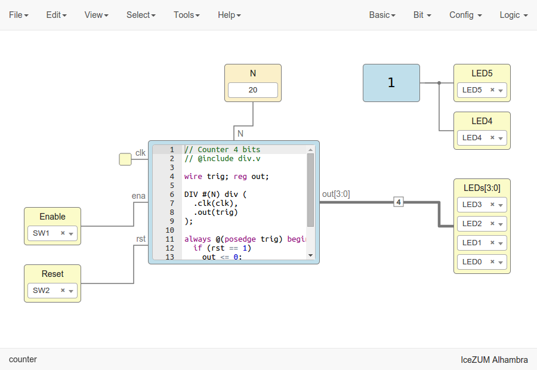
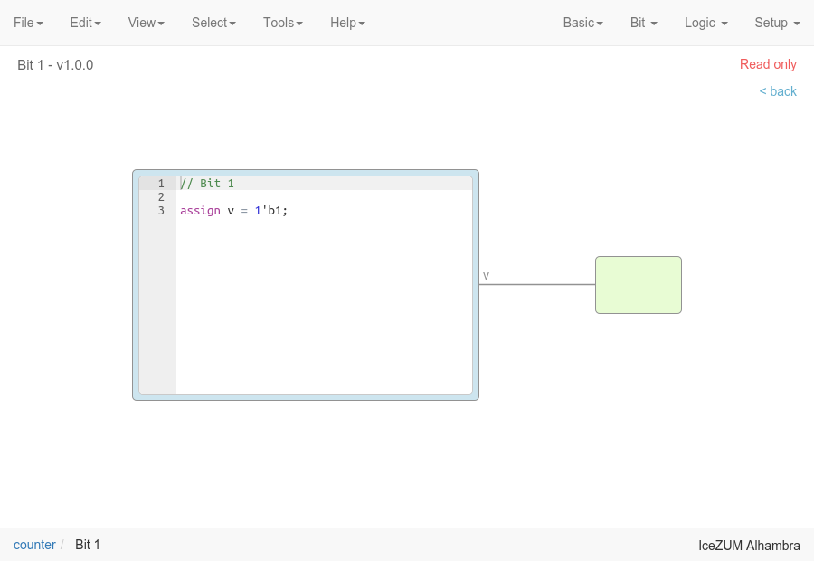

.. _userguide:

User Guide
==========



Menu
----

File
````

+-----------------+----------------------------------------------+--------------+-----------+
|     Action      |                 Description                  |   Shorcuts   |  Mac OS   |
+=================+==============================================+==============+===========+
|       New       |             Create a new window              |    Ctrl+N    |    ⌘+N    |
+-----------------+----------------------------------------------+--------------+-----------+
|     Open...     |                Open a project                |    Ctrl+O    |    ⌘+O    |
+-----------------+----------------------------------------------+--------------+-----------+
|     Blocks      |           Show the selected blocks           |              |           |
+-----------------+----------------------------------------------+--------------+-----------+
|    Examples     |          Show the selected examples          |              |           |
+-----------------+----------------------------------------------+--------------+-----------+
| Add as block... |           Add a project as a block           |              |           |
+-----------------+----------------------------------------------+--------------+-----------+
|      Save       |           Save the current project           |    Ctrl+S    |    ⌘+S    |
+-----------------+----------------------------------------------+--------------+-----------+
|   Save as...    |       Save the current with a new name       | Ctrl+Shift+S | Shift+⌘+S |
+-----------------+----------------------------------------------+--------------+-----------+
|    Export...    | Generate Verilog, PCF, Testbench and GTKwave |              |           |
+-----------------+----------------------------------------------+--------------+-----------+
|      Quit       |            Close the application             |    Ctrl+Q    |    ⌘+Q    |
+-----------------+----------------------------------------------+--------------+-----------+

.. note::

  When a project is added as a block, all FPGA information is removed before being stored.

Edit
````

+-------------+---------------------------------+-----------------------+-----------------+
|   Action    |           Description           |       Shortcut        |     Mac OS      |
+=============+=================================+=======================+=================+
|    Redo     |      Revert the last undo       | Ctrl+Y | Ctrl+Shift+Z | ⌘+Y | Shift+⌘+Z |
+-------------+---------------------------------+-----------------------+-----------------+
|     Cut     |       Cut selected blocks       |        Ctrl+X         |       ⌘+X       |
+-------------+---------------------------------+-----------------------+-----------------+
|    Copy     |      Copy selected blocks       |        Ctrl+C         |       ⌘+C       |
+-------------+---------------------------------+-----------------------+-----------------+
|    Paste    |       Paste copied blocks       |        Ctrl+V         |       ⌘+V       |
+-------------+---------------------------------+-----------------------+-----------------+
| Select all  |      Select all the blocks      |        Ctrl+A         |       ⌘+A       |
+-------------+---------------------------------+-----------------------+-----------------+
| Reset view  |   Reset pan & zoom to default   |        Ctrl+0         |       ⌘+0       |
+-------------+---------------------------------+-----------------------+-----------------+
| Fit content | Fit the content into the screen |        Ctrl+1         |       ⌘+1       |
+-------------+---------------------------------+-----------------------+-----------------+

Preferences
'''''''''''

**Project information**

Contains all the information about the project:

  .. image:: ../resources/images/userguide/project-info.png

  |

* Name: project name
* Version: version number
* Description: information shown in the block tooltip
* Author: creator of the project
* Image: SVG shown in the block body

**Board rules**

Enable or disable globally the board rules. These rules allow to automate tasks such as default port connections or default pin values. For example, the IceZUM Alhambra rules are:

* All not connected "clk" ports are connected to the internal CLK signal.
* All not used LEDs are turned off.

More information in the `Board rules section <./rules.html>`_.

**Language**

The supported languages are:

* English
* Spanish
* Galician
* Basque
* French
* Catalan

**Remote hostname**

Set the hostame of a remote device with an FPGA board connected. The format is user@host. For example, pi@192.168.0.22. Verify, Build and Upload functions will be executed in this host, that must have apio pre-configured.

View
````

+-------------+---------------------------------------------+
|   Action    |                 Description                 |
+=============+=============================================+
|     PCF     |           Show the board PCF file           |
+-------------+---------------------------------------------+
|    Pinout   |          Show the board SVG pinout          |
+-------------+---------------------------------------------+
|  Datasheet  | Open a web browser with the board datasheet |
+-------------+---------------------------------------------+
| Board rules |         Show the current board rules        |
+-------------+---------------------------------------------+


Select
``````

**Board**

Select the FPGA board. The supported boards are:

* `IceZUM Alhambra <https://github.com/FPGAwars/icezum>`_
* `Kéfir I iCE40-HX4K <http://fpgalibre.sourceforge.net/Kefir/>`_
* `Nandland Go board <https://www.nandland.com/goboard/introduction.html>`_
* `iCE40-HX8K Breakout Board <http://www.latticesemi.com/en/Products/DevelopmentBoardsAndKits/iCE40HX8KBreakoutBoard.aspx>`_
* `iCEstick Evaluation Kit <http://www.pighixxx.com/test/portfolio-items/icestick/>`_
* `icoBOARD 1.0 <http://icoboard.org/about-icoboard.html>`_

When a board is selected all I/O block combos are updated and its current values reset.

.. hint::

  This information is stored in the `app/resources/boards` directory. In order to support a new board just create a new directory with the *info.json*, *pinout.pcf* and *pinout.svg* (optional) files with its information. The *pinout.json* file must be generated from the *pinout.pcf* using the *generator.py* script.

**Collection**

Select the Collection from the installed collections (**Tools > Collections**). A collection is composed by **blocks** and **examples**. When a collections is selected, the following sections are updated with the collection content:

* File > Blocks
* File > Examples
* Menu blocks

.. note::

  The *Default* collection is always available, and contains the blocks and examples distributed within the application.

Tools
`````

+--------+----------------------------------------------------------------+----------+--------+
| Action |                          Description                           | Shortcut | Mac OS |
+========+================================================================+==========+========+
| Verify |                Check the generated verilog code                |  Ctrl+R  |  ⌘+R   |
+--------+----------------------------------------------------------------+----------+--------+
| Build  |            Synthesize the bitstream from the design            |  Ctrl+B  |  ⌘+B   |
+--------+----------------------------------------------------------------+----------+--------+
| Upload |  Synthesize (if required) and upload the bitstream to the FPGA |  Ctrl+U  |  ⌘+U   |
+--------+----------------------------------------------------------------+----------+--------+

Toolchain
'''''''''

+----------------+-----------------------------------------------------------------------------------+
|     Action     |                                    Description                                    |
+================+===================================================================================+
| Install/Update | Install a virtualenv, apio and the required apio packages. It requires Python 2.7 |
+----------------+-----------------------------------------------------------------------------------+
|     Remove     |                         Remove the toolchain directories                          |
+----------------+-----------------------------------------------------------------------------------+
| Reset default  |             Restore the default toolchain distributed within Icestudio            |
+----------------+-----------------------------------------------------------------------------------+
|  Apio version  |                           Show the current apio version                           |
+----------------+-----------------------------------------------------------------------------------+

Drivers
'''''''

+---------+------------------------------------------------------------------------+
| Action  |                              Description                               |
+=========+========================================================================+
| Enable  | Launch the FTDI drivers configuration. Each OS has a different process |
+---------+------------------------------------------------------------------------+
| Disable | Revert the FTDI drivers configuration. Each OS has a different process |
+---------+------------------------------------------------------------------------+

Collections
'''''''''''

+------------+---------------------------------------------+
|   Action   |                 Description                 |
+============+=============================================+
|    Add     | Add a ZIP file with one or more collections |
+------------+---------------------------------------------+
|   Remove   |       Remove the selected collection        |
+------------+---------------------------------------------+
| Remove all |         Remove all the collections          |
+------------+---------------------------------------------+

.. note::

  A collection is composed by **blocks** and **examples** sorted by categories (directories). The **package.json** file is required and contains information about the collection. The **locale** directory is optional and contains the translations for the blocks and examples. A collection must have the following structure:

  .. code::

    Collection/
    ├── blocks
    ├── examples
    ├── locale
    └── package.json


  A ZIP file of collections contains one or more *Collection directories* at the main level. A collection can be selected in **Select > Collections**.

  More information in the `Default collection <https://github.com/FPGAwars/icestudio/tree/develop/app/resources/collection>`_.

.. hint::

    When a ZIP file is added to Icestudio, it is installed in `~/.icestudio/collections`.


Help
````

+-----------------+---------------------------------------------------+
|     Action      |                    Description                    |
+=================+===================================================+
|  View license   |    Open the Icestudio license in a web browser    |
+-----------------+---------------------------------------------------+
|     Version     |       Show the Icestudio current version          |
+-----------------+---------------------------------------------------+
|  Documentation  | Open the Icestudio documentation in a web browser |
+-----------------+---------------------------------------------------+
|   Source code   |  Open the Icestudio source code in a web browser  |
+-----------------+---------------------------------------------------+
| Community forum |     Open the FPGAwars forum in a web browser      |
+-----------------+---------------------------------------------------+
| About Icestudio |         Information about the application         |
+-----------------+---------------------------------------------------+


Blocks menu
-----------

Basic
`````

It contains the basic blocks:

* **Input**: show a dialog to insert the name and type of the input block.
* **Output**: show a dialog to insert the name and type of the output block.
* **Constant**: show a dialog to insert the name and type of the constant block.
* **Code**: show a dialog to insert the ports and parameters of the code block.
* **Information**: create an empty text box block.

.. note::

  **Input** and **output** ports can be set to **virtual**. Virtual ports are used to independent-FPGA projects.
  Also, they can be configured as a **bus** by adding the notation ``[x:y]`` to the port name.

.. note::

  **Constant** blocks can be set to **local**. Local parameters are not exposed when the project is added as a block.

.. hint::

  Multiple **input**, **output** and **constant** blocks can be created using the `comma` separator. For example: ``x, y, z`` will create 3 blocks with those names. FPGA I/O ports values are set in the block combo box. These values can be set by searching and also unset by doing click on the cross.
  Double click over **input**, **output** or **constant** block allows to modify the block name and type.
  In **code** block ports definition, multiple *input* and *output* ports, and *parameters*, can be created also using the `comma` separator.


Stored blocks and collections
`````````````````````````````

It contains all stored blocks sorted by categories. This menu is generated when the application starts. It can show the Default blocks or any installed collection.

Design
------

This is the main panel. It contains the blocks and the wires.


Pan & Zoom
``````````

Pan is performed using the **Ctrl + mouse left button** or **mouse right button** over the background. Zoom is performed using **mouse wheel**. Both values can be reset in *Edit > Reset view*.

.. image:: ../resources/images/userguide/pan-zoom.png


Select
``````

Block selection is performed using the **mouse left button**. Blocks can be **selected/unselected** individually using **left-click/Shift+left-click**, respectively. In addition, several blocks can be selected by a **selection box**. When using the **Shift key**, the new selection is added to the previous one. A selection is canceled when the background is **left-clicked**.

.. image:: ../resources/images/userguide/select.png

Move blocks
```````````

Any block or blocks selection can be moved in the design using the **mouse left button** over the block or the selection. Also a blocks selection can be moved with the **arrow keys**.



Resize text blocks
``````````````````

**Code** and **Information** blocks can be resized with the resize tool in the **bottom-right corner** of the block.



Block examination
`````````````````

Non-basic blocks can be read only examined by **double clicking** the block using the **mouse left button**. This is a recursive action. In order to go back, click on the **< back** link or press the **back key**.

During the examination, pan, zoom and code navigation are enabled. Also the 'Reset view' and 'Fit content' actions.



.. note::

  The examination path is stored in the **breadcrumbs**. This allows to go back to any previous block.


Undo/Redo
``````````

Icestudio allows to undo/redo the following actions:

* Add or remove a block.
* Add or remove a wire.
* Move a block or a blocks selection.
* Edit an I/O block: name, type and value.
* Edit a Constant block: name, type and value.
* Edit a Code block: ports, parameters and content.
* Edit an Information block: content.
* Change the board.


Take a snapshot
---------------

Taking a **png** snapshot of the application is as easy as press **Ctrl+P**. A save dialog appears to set the name and the path of the captured image.
